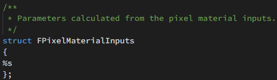
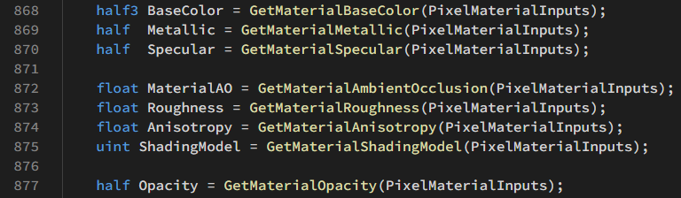
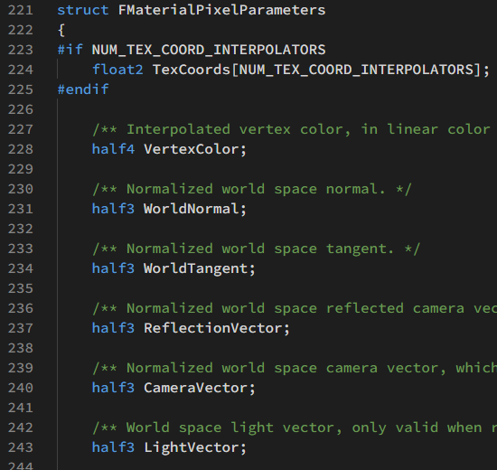
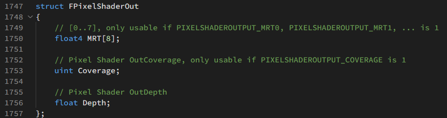
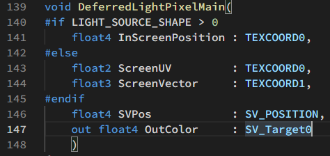
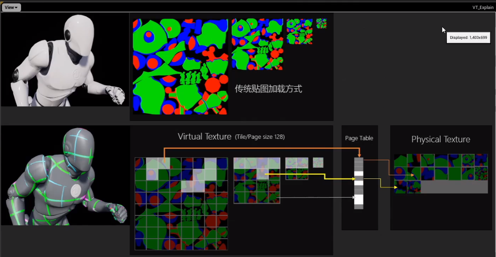
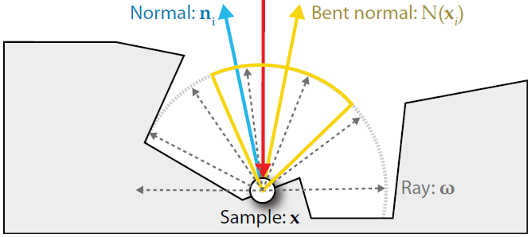

# UE4 着色器初探
基于 Unreal 4.26
[toc]


## 数据传递

### 材质编辑器->着色器

#### SceneTypes.h

* 枚举类型 EMaterialProperty包含了材质编辑器可传递的属性。

#### Material.cpp

* 实现方法 UMaterial::IsPropertyActiveInDerived，在该函数中判断当前ShadingModel需要在材质编辑器中激活哪些pin。
* 实现方法 FMaterialResource::CompilePropertyAndSetMaterialProperty ，将材质属性传递给材质编译器FMaterialCompiler。FMaterialCompiler完成shader代码的拼装。

#### MaterialShaderType.h

* c++到shader的绑定宏IMPLEMENT_MATERIAL_SHADER_TYPE

### 顶点着色器

#### 输入数据 LocalVertexFactory.ush

FVertexFactoryInput这个数据结构是来自C++端的数据输入


#### 输出数据 BasePassVertexCommon.ush
FBasePassVSOutput 有两种定义。开启曲面细分会使用 FBasePassVSToDS ，进入DS着色器。否则使用FBasePassVSToPS， 进入PS着色器。

FBasePassVSToPS 有两个嵌套的结构


FVertexFactoryInterpolantsVSToPS 定义在各个顶点工厂的 .ush 文件中。UE4中有很多VertexFactory用来处理不同网格类型，每种VertexFactory都有自己的输出结构的函数，供顶点着色器调用。例如，在LocalVertexFactoryCommon.ush可以找到输出结构的定义。

FBasePassInterpolantsVSToPS 在 BasePassCommon.ush 重定义为 FSharedBasePassInterpolants。

### 像素着色器

像素着色器有三部分输入：顶点着色器、材质编辑器、系统变量。其中来自顶点着色器和系统变量合并为 MaterialParameters 。

前向渲染将颜色输出到MRT、延迟渲染将GBuffer输出到MRT、SV_Target。

#### 顶点着色器输入 

Common.ush： FPixelShaderIn

BasePassVertexCommon.ush： FVertexFactoryInterpolantsVSToPS

BasePassVertexCommon.ush： FBasePassInterpolantsVSToPS

#### 材质编辑器输入 MaterialTemplate.ush

材质编辑器会用拼装好的shader代码替换 %s



在 BasePassPixelShader.usf 中读取这些属性



#### 材质参数输入   MaterialTemplate.ush

FMaterialPixelParameters包含了像素着色器所需的其他数据



#### 输出结构 Common.ush

在前向渲染中，BasePassPixelShader.usf会将最终计算的颜色输出到 FPixelShaderOut.MRT[0]



#### 写入GBuffer  BasePassPixelShader.usf


#### 延迟光照输出 DeferredLightPixelShaders.usf

延迟光照输出到SV_Target0，完成渲染。



## BasePassVertexShader

### 获取世界空间坐标（未偏移）

```glsl
float4 WorldPositionExcludingWPO = VertexFactoryGetWorldPosition(Input, VFIntermediates);
float4 WorldPosition = WorldPositionExcludingWPO;
```

### 局部空间切线

```glsl
float3x3 TangentToLocal = VertexFactoryGetTangentToLocal(Input, VFIntermediates);
```

### 获取世界坐标偏移

```glsl
WorldPosition.xyz += GetMaterialWorldPositionOffset(VertexParameters);
```

### 计算剪裁空间坐标

```glsl
float4 RasterizedWorldPosition = VertexFactoryGetRasterizedWorldPosition(Input, VFIntermediates, WorldPosition);
ClipSpacePosition = INVARIANT(mul(RasterizedWorldPosition, ResolvedView.TranslatedWorldToClip));
Output.Position = INVARIANT(ClipSpacePosition);
```

### 计算顶点雾

```glsl
#if BASEPASS_ATMOSPHERIC_FOG
Output.BasePassInterpolants.VertexFog = CalculateVertexAtmosphericFog(WorldPosition.xyz, ResolvedView.TranslatedWorldCameraOrigin);
#else
Output.BasePassInterpolants.VertexFog = CalculateHeightFog(WorldPosition.xyz - ResolvedView.TranslatedWorldCameraOrigin);
#endif
```

### 透明物体顶点光照

```glsl
#if TRANSLUCENCY_ANY_PERVERTEX_LIGHTING
float3 WorldPositionForVertexLightingTranslated = VertexFactoryGetPositionForVertexLighting(Input, VFIntermediates, WorldPosition.xyz);
float3 WorldPositionForVertexLighting = WorldPositionForVertexLightingTranslated - ResolvedView.PreViewTranslation.xyz;
#endif
```

透明物体的两种逐顶点光照: TRANSLUCENCY_PERVERTEX_LIGHTING_VOLUME 和 TRANSLUCENCY_PERVERTEX_FORWARD_SHADING

### 其他部分

预计算体积光照

速度缓冲

## BasePassPixelShader (DefaultLit) 

### 获取材质参数（MaterialParameters）、材质编辑器数据（PixelMaterialInputs）

```glsl
FMaterialPixelParameters MaterialParameters = GetMaterialPixelParameters(Interpolants, In.SvPosition);
FPixelMaterialInputs PixelMaterialInputs;
```

### 光照虚拟纹理

```glsl
float2 LightmapUV0, LightmapUV1;
uint LightmapDataIndex;
GetLightMapCoordinates(Interpolants, LightmapUV0, LightmapUV1, LightmapDataIndex);
LightmapVTPageTableResult = LightmapGetVTSampleInfo(LightmapUV0, LightmapDataIndex, In.SvPosition.xy);
```

支持虚拟纹理光照贴图可提高光照贴图烘焙的流送性能和质量。虚拟纹理可以分区域加载不同mipmap等级。虚拟纹理的最大mipmap等级由分区最小分辨率决定。由于虚拟纹理采用了随机三线性过滤，高频纹理会出现雪花噪点。
在 项目设置（Project Settings） 中的 引擎（Engine） > 渲染（Rendering） 下，设置 启用虚拟纹理光照贴图（Enable virtual texture lightmaps），以启用对光照贴图的虚拟纹理支持。


### 采样光照图AO

```glsl
float2 LightmapUV0, LightmapUV1;
uint LightmapDataIndex;
GetLightMapCoordinates(Interpolants, LightmapUV0, LightmapUV1, LightmapDataIndex);
MaterialParameters.AOMaterialMask = GetAOMaterialMask(LightmapVTPageTableResult, LightmapUV0 * float2(1, 2), LightmapDataIndex, In.SvPosition.xy);		//为什么要乘float2(1,2)？
```

### 计算额外参数（GetMaterialPixelParameters没有获取的）

TranslatedWorldPosition是camera空间坐标 -CameraVector

```glsl
float4 ScreenPosition = SvPositionToResolvedScreenPosition(In.SvPosition);
float3 TranslatedWorldPosition = SvPositionToResolvedTranslatedWorld(In.SvPosition);
CalcMaterialParametersEx(MaterialParameters, PixelMaterialInputs, In.SvPosition, ScreenPosition, In.bIsFrontFace, TranslatedWorldPosition, TranslatedWorldPosition);
```

### 像素深度偏移

```glsl
ApplyPixelDepthOffsetForBasePass(MaterialParameters, PixelMaterialInputs, BasePassInterpolants, Out.Depth);
```

应用材质编辑器中的Pixel Depth Offset。在BasePass中只会应用到VelocityPrevScreenPosition，VelocityScreenPosition，不会应用到Depth

### 像素clip

```glsl
#if !EARLY_Z_PASS_ONLY_MATERIAL_MASKING
	if (!bEditorWeightedZBuffering)
	{
	#if MATERIALBLENDING_MASKED_USING_COVERAGE
		Out.Coverage = DiscardMaterialWithPixelCoverage(MaterialParameters, PixelMaterialInputs);
	#else
		GetMaterialCoverageAndClipping(MaterialParameters, PixelMaterialInputs);
	#endif
	}
#endif
```

Alpha to Coverage就是在Alpha Test的基础上对其边缘进行一个平滑。原理是与MSAA配合，对子像素计算平均Coverage。每个fragment有一个coverage值，这个值是一个bitmask，比如4X就是4位，每一位记录了这个fragment在这个子像素区域是否覆盖了。resolve时将平均Coverage乘以输出颜色。

GetMaterialCoverageAndClipping中包含了直接剔除和透明度抖动两种方法。

### 获取材质编辑器参数

```glsl
half3 BaseColor = GetMaterialBaseColor(PixelMaterialInputs);
half  Metallic = GetMaterialMetallic(PixelMaterialInputs);
half  Specular = GetMaterialSpecular(PixelMaterialInputs);

float MaterialAO = GetMaterialAmbientOcclusion(PixelMaterialInputs);
float Roughness = GetMaterialRoughness(PixelMaterialInputs);
float Anisotropy = GetMaterialAnisotropy(PixelMaterialInputs);
uint ShadingModel = GetMaterialShadingModel(PixelMaterialInputs);

half Opacity = GetMaterialOpacity(PixelMaterialInputs);
```

### 计算体积光照贴图UV

```glsl
float3 VolumetricLightmapBrickTextureUVs;
#if PRECOMPUTED_IRRADIANCE_VOLUME_LIGHTING
	VolumetricLightmapBrickTextureUVs = ComputeVolumetricLightmapBrickTextureUVs(MaterialParameters.AbsoluteWorldPosition);
#endif
```

体积光照贴图是用于动态物体接收间接光照的方法。Lightmass将光照样本放置在关卡中的各个位置，并在光照构建期间为它们计算间接光照。每个这样的点都是一个体积光照贴图光照样本，它使用三阶球谐函数存储所有方向传来的光照。


### 数据传递到GBuffer

```glsl
FGBufferData GBuffer = (FGBufferData)0;
GBuffer.GBufferAO = MaterialAO;
// 0..1, 2 bits, use CastContactShadow(GBuffer) or HasDynamicIndirectShadowCasterRepresentation(GBuffer) to extract
GBuffer.PerObjectGBufferData = GetPrimitiveData(MaterialParameters.PrimitiveId).PerObjectGBufferData;
GBuffer.Depth = MaterialParameters.ScreenPosition.w;
// Static shadow factors for channels assigned by Lightmass
// Lights using static shadowing will pick up the appropriate channel in their deferred pass
GBuffer.PrecomputedShadowFactors = GetPrecomputedShadowMasks(LightmapVTPageTableResult, Interpolants, MaterialParameters.PrimitiveId, MaterialParameters.AbsoluteWorldPosition, VolumetricLightmapBrickTextureUVs);

//交错梯度噪声
const float GBufferDither = InterleavedGradientNoise(MaterialParameters.SvPosition.xy, View.StateFrameIndexMod8);
// Use GBuffer.ShadingModelID after SetGBufferForShadingModel(..) because the ShadingModel input might not be the same as the output
SetGBufferForShadingModel(
		GBuffer,
		MaterialParameters,
		Opacity,
		BaseColor,
		Metallic,
		Specular,
		Roughness,
		Anisotropy,
		SubsurfaceColor,
		SubsurfaceProfile,
		GBufferDither,
		ShadingModel
	);

#if USES_GBUFFER
	GBuffer.SelectiveOutputMask = GetSelectiveOutputMask();
	GBuffer.Velocity = 0;
#endif
```

FGBufferData 定义在 DeferredShadingCommon.ush ，注释说明了各个变量的取值和用途。

GBuffer的确切内容可能有所不同，根据您的项目设置，可以改变通道数量及其用途。一个常见的案例是5纹理GBuffer，A到E. `GBufferA.rgb = World Normal`，`PerObjectGBufferData`填充alpha通道。`GBufferB.rgba = Metallic, Specular, Roughness, ShadingModelID`。`GBufferC.rgb`是`BaseColor`与`GBufferAO`填充alpha通道。`GBufferD`专用于自定义数据，`GBufferE`适用于预先计算的阴影因子。解析GBuffer的代码： DefferredShadingCommon.ush的函数DecodeGBufferData。

* 交错梯度噪声

```glsl
float InterleavedGradientNoise( float2 uv, float FrameId )
{
	// magic values are found by experimentation
	uv += FrameId * (float2(47, 17) * 0.695f);

    const float3 magic = float3( 0.06711056f, 0.00583715f, 52.9829189f );
    return frac(magic.z * frac(dot(uv, magic.xy)));
}
```

[Dithering part three – real world 2D quantization dithering]: https://bartwronski.com/2016/10/30/dithering-part-three-real-world-2d-quantization-dithering/

一种使用噪声解决低量化位数造成条纹的方法。下图使用的噪声依次是White noise, blue noise, Bayer, interleaved gradient noise


这个变量可能与SSAO有关，但是 SetGBufferForShadingModel （位于ShadingModelsMaterial.ush）并没有用到这个变量。

### 速度缓冲（用于动态模糊）

```glsl
#if WRITES_VELOCITY_TO_GBUFFER
	BRANCH
	if (GetPrimitiveData(MaterialParameters.PrimitiveId).OutputVelocity > 0 || View.ForceDrawAllVelocities != 0)
	{
		// 2d velocity, includes camera an object motion
	#if WRITES_VELOCITY_TO_GBUFFER_USE_POS_INTERPOLATOR
		float3 Velocity = Calculate3DVelocity(BasePassInterpolants.VelocityScreenPosition, BasePassInterpolants.VelocityPrevScreenPosition);
	#else
		float3 Velocity = Calculate3DVelocity(MaterialParameters.ScreenPosition, BasePassInterpolants.VelocityPrevScreenPosition);
	#endif

		float4 EncodedVelocity = EncodeVelocityToTexture(Velocity);

		FLATTEN
		if (GetPrimitiveData(MaterialParameters.PrimitiveId).DrawsVelocity == 0.0 && View.ForceDrawAllVelocities == 0)
		{
			// TODO: remove one of the DrawsVelocity or OutputVelocity
			EncodedVelocity = 0.0;
		}

	#if USES_GBUFFER
		GBuffer.Velocity = EncodedVelocity;
	#else
		OutVelocity = EncodedVelocity;
	#endif
	}
#endif
```

### 处理高光颜色

```glsl
GBuffer.SpecularColor = ComputeF0(Specular, BaseColor, Metallic);

//located in the ShadingCommon.ush
float3 ComputeF0(float Specular, float3 BaseColor, float Metallic)
{
	return lerp(DielectricSpecularToF0(Specular).xxx, BaseColor, Metallic.xxx);
}
float DielectricSpecularToF0(float Specular)
{
	return 0.08f * Specular;
}
```

非金属为 0.08f * Specular ，金属为 BaseColor。利用金属度非黑即白的特性，UE4在同一个材质中兼容了Metallic 和 Specular  两种工作流。

### EnvBRDFApprox（Fully Rough）

```glsl
#if !FORCE_FULLY_ROUGH
	if (View.RenderingReflectionCaptureMask) 
#endif
	{
		EnvBRDFApproxFullyRough(GBuffer.DiffuseColor, GBuffer.SpecularColor);
	}
// When rendering reflection captures, GBuffer.Roughness is already forced to 1 using RoughnessOverrideParameter in GetMaterialRoughness.

//Located in BRDF.ush
void EnvBRDFApproxFullyRough(inout half3 DiffuseColor, inout half3 SpecularColor)
{
	// Factors derived from EnvBRDFApprox( SpecularColor, 1, 1 ) == SpecularColor * 0.4524 - 0.0024
	DiffuseColor += SpecularColor * 0.45;
	SpecularColor = 0;
	// We do not modify Roughness here as this is done differently at different places.
}
```

渲染反射探头和开启Fully Rought时，简单将SpecularColor叠加到DiffuseColor，仅计算漫反射。见后文前向渲染（Fully Routh）；

### 环境法线处理AO

```glsl
float3 BentNormal = MaterialParameters.WorldNormal;
float DiffOcclusion = MaterialAO;
float SpecOcclusion = MaterialAO;

//Located in BasePassPixelShader.usf
ApplyBentNormal( MaterialParameters, GBuffer.Roughness, BentNormal, DiffOcclusion, SpecOcclusion );
GBuffer.GBufferAO = AOMultiBounce( Luminance( GBuffer.SpecularColor ), SpecOcclusion ).g;
```

* Bent Normal

对原始的Normal做修改之后的新向量，它指向了当前像素一个不被其它物体（或几何体元）遮挡的平均方向，也即光线传入的主要方向。



* AOMultiBounce

```glsl
// [ Jimenez et al. 2016, "Practical Realtime Strategies for Accurate Indirect Occlusion" ]
float3 AOMultiBounce( float3 BaseColor, float AO )
{
	float3 a =  2.0404 * BaseColor - 0.3324;
	float3 b = -4.7951 * BaseColor + 0.6417;
	float3 c =  2.7552 * BaseColor + 0.6903;
	return max( AO, ( ( AO * a + b ) * AO + c ) * AO );
}
```

考虑到环境光在物体表面会发生反射，将周围的物体照亮，因此我们得到的AO系数其实是偏小的，因为光照会多次反弹，所以实际上物体表面应该会稍微更亮一点点。多次反弹后的照亮效果，和物体表面的反照率相关，反照率越高，就能将周围照的更亮。使用由光线追踪得到的AO系数作为参照，尝试用多项式拟合函数曲线，得到大致的拟合曲线


### 光照贴图和天光

```glsl
float3 DiffuseIndirectLighting;
float3 SubsurfaceIndirectLighting;	//Defaultlit也需要计算SubsurfaceIndirectLighting，但是SubsurfaceColor=0，不起作用。

//SH计算天光、体积光、点光的间接光照。采样LightMap。还有一部分与半透明前向着色，顶点雾化和调试相关的代码
//DiffuseDir就是环境法线
GetPrecomputedIndirectLightingAndSkyLight(MaterialParameters, Interpolants, BasePassInterpolants, LightmapVTPageTableResult, GBuffer, DiffuseDir, VolumetricLightmapBrickTextureUVs, DiffuseIndirectLighting, SubsurfaceIndirectLighting, IndirectIrradiance);

// 非直接光照应用AO.
float IndirectOcclusion = 1.0f;
float2 NearestResolvedDepthScreenUV = 0;
float DirectionalLightShadow = 1.0f;

#if FORWARD_SHADING && (MATERIALBLENDING_SOLID || MATERIALBLENDING_MASKED)	
   //MATERIALBLENDING_SOLID对应的是Opaque Mode，MATERIALBLENDING_MASKED对应的是AlphaTest
			float2 NDC = MaterialParameters.ScreenPosition.xy / MaterialParameters.ScreenPosition.w;
			float2 ScreenUV = NDC * ResolvedView.ScreenPositionScaleBias.xy + ResolvedView.ScreenPositionScaleBias.wz;
			//Resolve次像素的最小Depth，Located in ForwardLightingCommon.ush
			NearestResolvedDepthScreenUV = CalculateNearestResolvedDepthScreenUV(ScreenUV, MaterialParameters.ScreenPosition.w);
			//从IndirectOcclusionTexture获取，并对角色进行特殊处理以减少遮蔽。  Located in ForwardLightingCommon.ush
			IndirectOcclusion = GetIndirectOcclusion(NearestResolvedDepthScreenUV, GBuffer);
			DiffuseIndirectLighting *= IndirectOcclusion;
			SubsurfaceIndirectLighting *= IndirectOcclusion;
			IndirectIrradiance *= IndirectOcclusion;
#endif

//最终环境漫反射
DiffuseColor += (DiffuseIndirectLighting * DiffuseColorForIndirect + SubsurfaceIndirectLighting * SubsurfaceColor) * AOMultiBounce( GBuffer.BaseColor, DiffOcclusion );
```

### 透明物体顶点光照

```glsl
Color += BasePassInterpolants.VertexDiffuseLighting * GBuffer.DiffuseColor;
```

### 前向渲染（直接光照）

```glsl
uint GridIndex = 0;

			#if FEATURE_LEVEL >= FEATURE_LEVEL_SM5
				GridIndex = ComputeLightGridCellIndex((uint2)(MaterialParameters.SvPosition.xy * View.LightProbeSizeRatioAndInvSizeRatio.zw - ResolvedView.ViewRectMin.xy), MaterialParameters.SvPosition.w, EyeIndex);

				#if FORWARD_SHADING || TRANSLUCENCY_LIGHTING_SURFACE_FORWARDSHADING || MATERIAL_SHADINGMODEL_SINGLELAYERWATER
					const float Dither = InterleavedGradientNoise(MaterialParameters.SvPosition.xy, View.StateFrameIndexMod8);
					FDeferredLightingSplit ForwardDirectLighting = GetForwardDirectLightingSplit(GridIndex, MaterialParameters.AbsoluteWorldPosition, MaterialParameters.CameraVector, GBuffer, NearestResolvedDepthScreenUV, MaterialParameters.PrimitiveId, EyeIndex, Dither, DirectionalLightShadow);
	
						Color += ForwardDirectLighting.DiffuseLighting.rgb;
						Color += ForwardDirectLighting.SpecularLighting.rgb;
					#endif
				#endif
			#endif
```

* 灯光剔除

UE4会把场景中的灯光按照屏幕空间分成相应的grid，类似于cluster shading的方法，注意这里的grid只考虑点光源，聚光灯，以及reflection captures，UE4这一步是通过compute shader实现的，所以只在sm>5.0的平台上有。具体shader代码在LightGridInjection.usf，阅读代码之后我们可以发现 UE4的灯光空间grid的划分是按照指数增长的。也就是每个grid的z随着距离会增长。在真正计算光照时，我们可以用GridIndex来快速决定某点是否受到灯光影响。

* 计算光照

```glsl
float3 GetForwardDirectLightingForVertexLighting(uint GridIndex, float3 WorldPosition, float SceneDepth, float3 WorldNormal, uint EyeIndex)
{
	float3 DirectLighting = 0;
	// Using white for diffuse color, real diffuse color will be incorporated per-pixel
	float3 DiffuseColor = 1.0f;

	const FDirectionalLightData DirectionalLightData = GetDirectionalLightData(EyeIndex);

	BRANCH
	if (DirectionalLightData.HasDirectionalLight)
	{
		float3 N = WorldNormal;
		float3 L = DirectionalLightData.DirectionalLightDirection;
		float NoL = saturate(dot(N, L));

		float3 LightColor = DirectionalLightData.DirectionalLightColor;
	
		#if NON_DIRECTIONAL_DIRECT_LIGHTING
			NoL = 1.0f;
		#endif

		float ShadowFactor = ComputeDirectionalLightStaticShadowing(WorldPosition);
		ShadowFactor *= ComputeDirectionalLightDynamicShadowing(WorldPosition, SceneDepth);

		// No specular for vertex lighting
		float3 DiffuseLighting = Diffuse_Lambert(DiffuseColor);
		DirectLighting += LightColor * (NoL * ShadowFactor) * DiffuseLighting;
	}
	
	const FCulledLightsGridData CulledLightsGrid = GetCulledLightsGrid(GridIndex, EyeIndex);

	// Limit max to ForwardLightData.NumLocalLights.
	// This prevents GPU hangs when the PS tries to read from uninitialized NumCulledLightsGrid buffer
	const uint NumLocalLights = min(CulledLightsGrid.NumLocalLights, GetNumLocalLights(EyeIndex));

	LOOP
	for (uint LocalLightListIndex = 0; LocalLightListIndex < NumLocalLights; LocalLightListIndex++)
	{
		const FLocalLightData LocalLight = GetLocalLightData(CulledLightsGrid.DataStartIndex + LocalLightListIndex, EyeIndex);
		 
		FSimpleDeferredLightData LightData = (FSimpleDeferredLightData)0;
		LightData.Position = LocalLight.LightPositionAndInvRadius.xyz;
		LightData.InvRadius = LocalLight.LightPositionAndInvRadius.w;
		LightData.Color = LocalLight.LightColorAndFalloffExponent.xyz;
		LightData.FalloffExponent = LocalLight.LightColorAndFalloffExponent.w;
		LightData.bInverseSquared = LightData.FalloffExponent == 0;
						
		// No specular for vertex lighting
		float3 CameraVector = 0;
		float3 SpecularColor = 0;
		float Roughness = 1.0f;
		DirectLighting += GetSimpleDynamicLighting(WorldPosition, CameraVector, WorldNormal, 1, DiffuseColor, SpecularColor, Roughness, LightData);
	}

	return DirectLighting;
}

```


### 前向渲染（IBL）

```glsl
#if !(MATERIAL_SINGLE_SHADINGMODEL && MATERIAL_SHADINGMODEL_HAIR) && (!MATERIAL_SHADINGMODEL_SINGLELAYERWATER || FORWARD_SHADING)
				if (GBuffer.ShadingModelID != SHADINGMODELID_HAIR)
				{
					int SingleCaptureIndex = GetPrimitiveData(MaterialParameters.PrimitiveId).SingleCaptureIndex;

					half3 ReflectionColor = GetImageBasedReflectionLighting(MaterialParameters, GBuffer.Roughness, GBuffer.SpecularColor, IndirectIrradiance, GridIndex, SingleCaptureIndex, EyeIndex)
						* IndirectOcclusion
						* AOMultiBounce(GBuffer.SpecularColor, SpecOcclusion);

					#if MATERIAL_SHADINGMODEL_THIN_TRANSLUCENT
						ColorSeparateSpecular += ReflectionColor;
					#else
						Color += ReflectionColor;
					#endif
				}
			#endif
```

### 前向渲染（FullyRough）

```glsl
#if SIMPLE_FORWARD_DIRECTIONAL_LIGHT && !MATERIAL_SHADINGMODEL_SINGLELAYERWATER && !MATERIAL_SHADINGMODEL_THIN_TRANSLUCENT

			float3 DirectionalLighting = GetSimpleForwardLightingDirectionalLight(
				GBuffer,
				DiffuseColorForIndirect,
				GBuffer.SpecularColor,
				GBuffer.Roughness,
				MaterialParameters.WorldNormal, 
				MaterialParameters.CameraVector);
			
			#if STATICLIGHTING_SIGNEDDISTANCEFIELD
				DirectionalLighting *= GBuffer.PrecomputedShadowFactors.x;
			#elif PRECOMPUTED_IRRADIANCE_VOLUME_LIGHTING
				DirectionalLighting *= GetVolumetricLightmapDirectionalLightShadowing(VolumetricLightmapBrickTextureUVs);
			#elif CACHED_POINT_INDIRECT_LIGHTING
				DirectionalLighting *= IndirectLightingCache.DirectionalLightShadowing;
			#endif
			
			Color += DirectionalLighting;

		#endif
```

