# UE4 着色器初探
基于 Unreal 4.26
[toc]


## 数据传递

### 材质编辑器->着色器

#### SceneTypes.h

* 枚举类型 EMaterialProperty包含了材质编辑器可传递的属性。

#### Material.cpp

* 实现方法 UMaterial::IsPropertyActiveInDerived，在该函数中判断当前ShadingModel需要在材质编辑器中激活哪些pin。
* 实现方法 FMaterialResource::CompilePropertyAndSetMaterialProperty ，将材质属性传递给材质编译器FMaterialCompiler。FMaterialCompiler完成shader代码的拼装。

#### MaterialShaderType.h

* c++到shader的绑定宏IMPLEMENT_MATERIAL_SHADER_TYPE

### 顶点着色器

#### 输入数据 LocalVertexFactory.ush

FVertexFactoryInput这个数据结构是来自C++端的数据输入

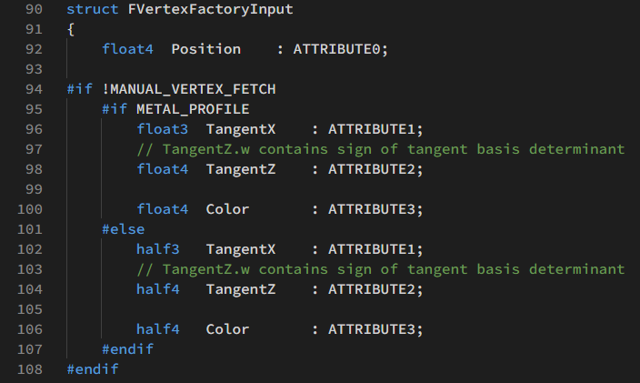

#### 输出数据 BasePassVertexCommon.ush
FBasePassVSOutput 有两种定义。开启曲面细分会使用 FBasePassVSToDS ，进入DS着色器。否则使用FBasePassVSToPS， 进入PS着色器。

FBasePassVSToPS 有两个嵌套的结构

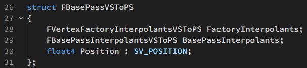

FVertexFactoryInterpolantsVSToPS 定义在各个顶点工厂的 .ush 文件中。UE4中有很多VertexFactory用来处理不同网格类型，每种VertexFactory都有自己的输出结构的函数，供顶点着色器调用。例如，在LocalVertexFactoryCommon.ush可以找到输出结构的定义。

FBasePassInterpolantsVSToPS 在 BasePassCommon.ush 重定义为 FSharedBasePassInterpolants。

### 像素着色器

像素着色器有三部分输入：顶点着色器、材质编辑器、系统变量。其中来自顶点着色器和系统变量合并为 MaterialParameters 。

前向渲染将颜色输出到MRT、延迟渲染将GBuffer输出到MRT、SV_Target。

#### 顶点着色器输入 

Common.ush： FPixelShaderIn

BasePassVertexCommon.ush： FVertexFactoryInterpolantsVSToPS

BasePassVertexCommon.ush： FBasePassInterpolantsVSToPS

#### 材质编辑器输入 MaterialTemplate.ush

材质编辑器会用拼装好的shader代码替换 %s

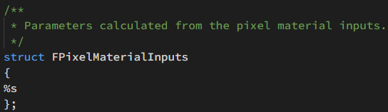

在 BasePassPixelShader.usf 中读取这些属性

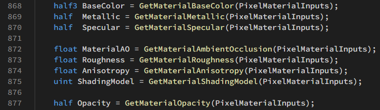

#### 材质参数输入   MaterialTemplate.ush

FMaterialPixelParameters包含了像素着色器所需的其他数据

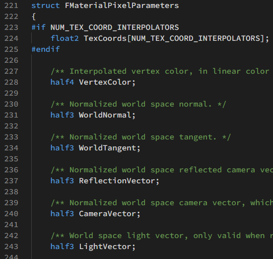

#### 输出结构 Common.ush

在前向渲染中，BasePassPixelShader.usf会将最终计算的颜色输出到 FPixelShaderOut.MRT[0]

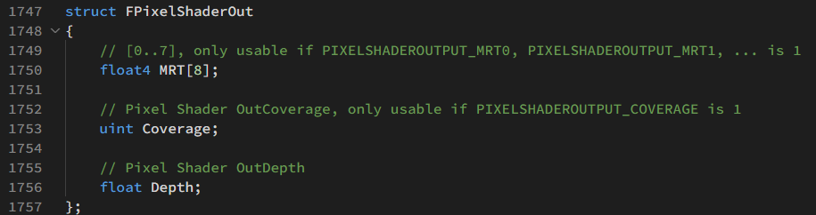

#### 写入GBuffer结构体，最后写入MRT才是真正的GBuffer  BasePassPixelShader.usf

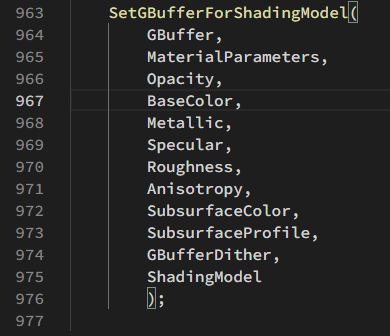

#### 延迟光照输出 DeferredLightPixelShaders.usf

延迟光照输出到SV_Target0，完成渲染。

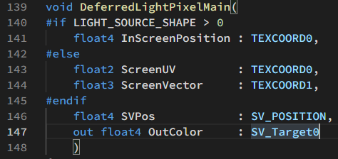

## BasePassVertexShader

### 获取世界空间坐标（未偏移）

```glsl
float4 WorldPositionExcludingWPO = VertexFactoryGetWorldPosition(Input, VFIntermediates);
float4 WorldPosition = WorldPositionExcludingWPO;
```

### 局部空间切线

```glsl
float3x3 TangentToLocal = VertexFactoryGetTangentToLocal(Input, VFIntermediates);
```

### 获取世界坐标偏移

```glsl
WorldPosition.xyz += GetMaterialWorldPositionOffset(VertexParameters);
```

### 计算剪裁空间坐标

```glsl
float4 RasterizedWorldPosition = VertexFactoryGetRasterizedWorldPosition(Input, VFIntermediates, WorldPosition);
ClipSpacePosition = INVARIANT(mul(RasterizedWorldPosition, ResolvedView.TranslatedWorldToClip));
Output.Position = INVARIANT(ClipSpacePosition);
```

### 计算顶点雾

```glsl
#if BASEPASS_ATMOSPHERIC_FOG
Output.BasePassInterpolants.VertexFog = CalculateVertexAtmosphericFog(WorldPosition.xyz, ResolvedView.TranslatedWorldCameraOrigin);
#else
Output.BasePassInterpolants.VertexFog = CalculateHeightFog(WorldPosition.xyz - ResolvedView.TranslatedWorldCameraOrigin);
#endif
```

### 透明物体顶点光照

```glsl
#if TRANSLUCENCY_ANY_PERVERTEX_LIGHTING
float3 WorldPositionForVertexLightingTranslated = VertexFactoryGetPositionForVertexLighting(Input, VFIntermediates, WorldPosition.xyz);
float3 WorldPositionForVertexLighting = WorldPositionForVertexLightingTranslated - ResolvedView.PreViewTranslation.xyz;
#endif
```

透明物体的两种逐顶点光照: TRANSLUCENCY_PERVERTEX_LIGHTING_VOLUME 和 TRANSLUCENCY_PERVERTEX_FORWARD_SHADING

### 其他部分

预计算体积光照

速度缓冲

## BasePassPixelShader (DefaultLit) 

### 获取材质参数（MaterialParameters）、材质编辑器数据（PixelMaterialInputs）

```glsl
FMaterialPixelParameters MaterialParameters = GetMaterialPixelParameters(Interpolants, In.SvPosition);
FPixelMaterialInputs PixelMaterialInputs;
```

### 光照虚拟纹理

```glsl
float2 LightmapUV0, LightmapUV1;
uint LightmapDataIndex;
GetLightMapCoordinates(Interpolants, LightmapUV0, LightmapUV1, LightmapDataIndex);
LightmapVTPageTableResult = LightmapGetVTSampleInfo(LightmapUV0, LightmapDataIndex, In.SvPosition.xy);
```

支持虚拟纹理光照贴图可提高光照贴图烘焙的流送性能和质量。虚拟纹理可以分区域加载不同mipmap等级。虚拟纹理的最大mipmap等级由分区最小分辨率决定。由于虚拟纹理采用了随机三线性过滤，高频纹理会出现雪花噪点。
在 项目设置（Project Settings） 中的 引擎（Engine） > 渲染（Rendering） 下，设置 启用虚拟纹理光照贴图（Enable virtual texture lightmaps），以启用对光照贴图的虚拟纹理支持。


### 采样光照图AO

```glsl
float2 LightmapUV0, LightmapUV1;
uint LightmapDataIndex;
GetLightMapCoordinates(Interpolants, LightmapUV0, LightmapUV1, LightmapDataIndex);
MaterialParameters.AOMaterialMask = GetAOMaterialMask(LightmapVTPageTableResult, LightmapUV0 * float2(1, 2), LightmapDataIndex, In.SvPosition.xy);		//为什么要乘float2(1,2)？
```

### 计算额外参数（GetMaterialPixelParameters没有获取的）

TranslatedWorldPosition是camera空间坐标 -CameraVector

```glsl
float4 ScreenPosition = SvPositionToResolvedScreenPosition(In.SvPosition);	//ScreenPosition是NDC空间的齐次坐标
float3 TranslatedWorldPosition = SvPositionToResolvedTranslatedWorld(In.SvPosition);
CalcMaterialParametersEx(MaterialParameters, PixelMaterialInputs, In.SvPosition, ScreenPosition, In.bIsFrontFace, TranslatedWorldPosition, TranslatedWorldPosition);
```

### 像素深度偏移

```glsl
ApplyPixelDepthOffsetForBasePass(MaterialParameters, PixelMaterialInputs, BasePassInterpolants, Out.Depth);
```

应用材质编辑器中的Pixel Depth Offset。在BasePass中只会应用到VelocityPrevScreenPosition，VelocityScreenPosition，不会应用到Depth

### 像素clip

```glsl
#if !EARLY_Z_PASS_ONLY_MATERIAL_MASKING
	if (!bEditorWeightedZBuffering)
	{
	#if MATERIALBLENDING_MASKED_USING_COVERAGE
		Out.Coverage = DiscardMaterialWithPixelCoverage(MaterialParameters, PixelMaterialInputs);
	#else
		GetMaterialCoverageAndClipping(MaterialParameters, PixelMaterialInputs);
	#endif
	}
#endif
```

Alpha to Coverage就是在Alpha Test的基础上对其边缘进行一个平滑。原理是与MSAA配合，对子像素计算平均Coverage。每个fragment有一个coverage值，这个值是一个bitmask，比如4X就是4位，每一位记录了这个fragment在这个子像素区域是否覆盖了。resolve时将平均Coverage乘以输出颜色。

GetMaterialCoverageAndClipping中包含了直接剔除和透明度抖动两种方法。

### 获取材质编辑器参数

```glsl
half3 BaseColor = GetMaterialBaseColor(PixelMaterialInputs);
half  Metallic = GetMaterialMetallic(PixelMaterialInputs);
half  Specular = GetMaterialSpecular(PixelMaterialInputs);

float MaterialAO = GetMaterialAmbientOcclusion(PixelMaterialInputs);
float Roughness = GetMaterialRoughness(PixelMaterialInputs);
float Anisotropy = GetMaterialAnisotropy(PixelMaterialInputs);
uint ShadingModel = GetMaterialShadingModel(PixelMaterialInputs);

half Opacity = GetMaterialOpacity(PixelMaterialInputs);
```

### 计算体积光照贴图UV

```glsl
float3 VolumetricLightmapBrickTextureUVs;
#if PRECOMPUTED_IRRADIANCE_VOLUME_LIGHTING
	VolumetricLightmapBrickTextureUVs = ComputeVolumetricLightmapBrickTextureUVs(MaterialParameters.AbsoluteWorldPosition);
#endif
```

体积光照贴图是用于动态物体接收间接光照的方法。Lightmass将光照样本放置在关卡中的各个位置，并在光照构建期间为它们计算间接光照。每个这样的点都是一个体积光照贴图光照样本，它使用三阶球谐函数存储所有方向传来的光照。

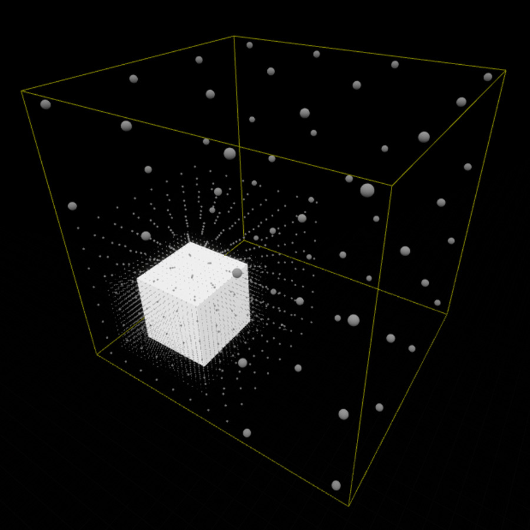

### 数据传递到GBuffer

```glsl
FGBufferData GBuffer = (FGBufferData)0;
GBuffer.GBufferAO = MaterialAO;
// 0..1, 2 bits, use CastContactShadow(GBuffer) or HasDynamicIndirectShadowCasterRepresentation(GBuffer) to extract
GBuffer.PerObjectGBufferData = GetPrimitiveData(MaterialParameters.PrimitiveId).PerObjectGBufferData;
GBuffer.Depth = MaterialParameters.ScreenPosition.w;
// Static shadow factors for channels assigned by Lightmass
// Lights using static shadowing will pick up the appropriate channel in their deferred pass
GBuffer.PrecomputedShadowFactors = GetPrecomputedShadowMasks(LightmapVTPageTableResult, Interpolants, MaterialParameters.PrimitiveId, MaterialParameters.AbsoluteWorldPosition, VolumetricLightmapBrickTextureUVs);

//交错梯度噪声
const float GBufferDither = InterleavedGradientNoise(MaterialParameters.SvPosition.xy, View.StateFrameIndexMod8);
// Use GBuffer.ShadingModelID after SetGBufferForShadingModel(..) because the ShadingModel input might not be the same as the output
SetGBufferForShadingModel(
		GBuffer,
		MaterialParameters,
		Opacity,
		BaseColor,
		Metallic,
		Specular,
		Roughness,
		Anisotropy,
		SubsurfaceColor,
		SubsurfaceProfile,
		GBufferDither,
		ShadingModel
	);

#if USES_GBUFFER
	GBuffer.SelectiveOutputMask = GetSelectiveOutputMask();
	GBuffer.Velocity = 0;
#endif
```

FGBufferData 定义在 DeferredShadingCommon.ush ，注释说明了各个变量的取值和用途。

GBuffer的确切内容可能有所不同，根据您的项目设置，可以改变通道数量及其用途。颜色输出部分介绍GBuffer结构。

* 交错梯度噪声

```glsl
float InterleavedGradientNoise( float2 uv, float FrameId )
{
	// magic values are found by experimentation
	uv += FrameId * (float2(47, 17) * 0.695f);

    const float3 magic = float3( 0.06711056f, 0.00583715f, 52.9829189f );
    return frac(magic.z * frac(dot(uv, magic.xy)));
}
```

[Dithering part three – real world 2D quantization dithering]: https://bartwronski.com/2016/10/30/dithering-part-three-real-world-2d-quantization-dithering/

一种使用噪声解决低量化位数造成条纹的方法。下图使用的噪声依次是White noise, blue noise, Bayer, interleaved gradient noise

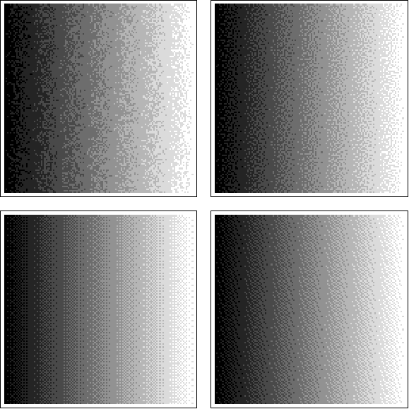

这个变量可能与SSAO有关，但是 SetGBufferForShadingModel （位于ShadingModelsMaterial.ush）并没有用到这个变量。

### 速度缓冲（用于动态模糊）

```glsl
#if WRITES_VELOCITY_TO_GBUFFER
	BRANCH
	if (GetPrimitiveData(MaterialParameters.PrimitiveId).OutputVelocity > 0 || View.ForceDrawAllVelocities != 0)
	{
		// 2d velocity, includes camera an object motion
	#if WRITES_VELOCITY_TO_GBUFFER_USE_POS_INTERPOLATOR
		float3 Velocity = Calculate3DVelocity(BasePassInterpolants.VelocityScreenPosition, BasePassInterpolants.VelocityPrevScreenPosition);
	#else
		float3 Velocity = Calculate3DVelocity(MaterialParameters.ScreenPosition, BasePassInterpolants.VelocityPrevScreenPosition);
	#endif

		float4 EncodedVelocity = EncodeVelocityToTexture(Velocity);

		FLATTEN
		if (GetPrimitiveData(MaterialParameters.PrimitiveId).DrawsVelocity == 0.0 && View.ForceDrawAllVelocities == 0)
		{
			// TODO: remove one of the DrawsVelocity or OutputVelocity
			EncodedVelocity = 0.0;
		}

	#if USES_GBUFFER
		GBuffer.Velocity = EncodedVelocity;
	#else
		OutVelocity = EncodedVelocity;
	#endif
	}
#endif
```

### 处理 SpecularColor

```glsl
GBuffer.SpecularColor = ComputeF0(Specular, BaseColor, Metallic);

//located in the ShadingCommon.ush
float3 ComputeF0(float Specular, float3 BaseColor, float Metallic)
{
	return lerp(DielectricSpecularToF0(Specular).xxx, BaseColor, Metallic.xxx);
}
float DielectricSpecularToF0(float Specular)
{
	return 0.08f * Specular;
}
```

非金属为 0.08f * Specular ，金属为 BaseColor。利用金属度非黑即白的特性，UE4在同一个材质中兼容了Metallic 和 Specular  两种工作流。

### 处理 Roughness

```glsl
#if MATERIAL_NORMAL_CURVATURE_TO_ROUGHNESS
	// Curvature-to-roughness uses derivatives of the WorldVertexNormal, which is incompatible with centroid interpolation because
	// the samples are not uniformly distributed. Therefore we use WorldVertexNormal_Center which is guaranteed to be center interpolated.
#if USE_WORLDVERTEXNORMAL_CENTER_INTERPOLATION
	float GeometricAARoughness = NormalCurvatureToRoughness(MaterialParameters.WorldVertexNormal_Center);
#else
	float GeometricAARoughness = NormalCurvatureToRoughness(MaterialParameters.TangentToWorld[2].xyz);
#endif
	GBuffer.Roughness = max(GBuffer.Roughness, GeometricAARoughness);

//Located in BasePassPixelShader.usf
float NormalCurvatureToRoughness(float3 WorldNormal)
{
    float3 dNdx = ddx(WorldNormal);
    float3 dNdy = ddy(WorldNormal);
    float x = dot(dNdx, dNdx);
    float y = dot(dNdy, dNdy);
    float CurvatureApprox = pow(max(x, y), View.NormalCurvatureToRoughnessScaleBias.z);
	return saturate(CurvatureApprox * View.NormalCurvatureToRoughnessScaleBias.x + View.NormalCurvatureToRoughnessScaleBias.y);
}
```

使用相邻像素的法线方向计算粗糙度。取几何粗糙度、输入粗糙度的最大值。

### 处理 DiffuseColor

```glsl
GBuffer.DiffuseColor = BaseColor - BaseColor * Metallic;
```

### EnvBRDFApprox（Fully Rough）

```glsl
#if !FORCE_FULLY_ROUGH
	if (View.RenderingReflectionCaptureMask) 
#endif
	{
		EnvBRDFApproxFullyRough(GBuffer.DiffuseColor, GBuffer.SpecularColor);
	}
// When rendering reflection captures, GBuffer.Roughness is already forced to 1 using RoughnessOverrideParameter in GetMaterialRoughness.

//Located in BRDF.ush
void EnvBRDFApproxFullyRough(inout half3 DiffuseColor, inout half3 SpecularColor)
{
	// Factors derived from EnvBRDFApprox( SpecularColor, 1, 1 ) == SpecularColor * 0.4524 - 0.0024
	DiffuseColor += SpecularColor * 0.45;
	SpecularColor = 0;
	// We do not modify Roughness here as this is done differently at different places.
}
```

渲染反射探头和开启Fully Rought时，简单将SpecularColor叠加到DiffuseColor，仅计算漫反射。见后文前向渲染（Fully Routh）；

### 环境法线处理AO

```glsl
float3 BentNormal = MaterialParameters.WorldNormal;
float DiffOcclusion = MaterialAO;
float SpecOcclusion = MaterialAO;

//Located in BasePassPixelShader.usf
ApplyBentNormal( MaterialParameters, GBuffer.Roughness, BentNormal, DiffOcclusion, SpecOcclusion );
GBuffer.GBufferAO = AOMultiBounce( Luminance( GBuffer.SpecularColor ), SpecOcclusion ).g;
```

* Bent Normal

对原始的Normal做修改之后的新向量，它指向了当前像素一个不被其它物体（或几何体元）遮挡的平均方向，也即光线传入的主要方向。


* AOMultiBounce

```glsl
// [ Jimenez et al. 2016, "Practical Realtime Strategies for Accurate Indirect Occlusion" ]
float3 AOMultiBounce( float3 BaseColor, float AO )
{
	float3 a =  2.0404 * BaseColor - 0.3324;
	float3 b = -4.7951 * BaseColor + 0.6417;
	float3 c =  2.7552 * BaseColor + 0.6903;
	return max( AO, ( ( AO * a + b ) * AO + c ) * AO );
}
```

考虑到环境光在物体表面会发生反射，将周围的物体照亮，因此我们得到的AO系数其实是偏小的，因为光照会多次反弹，所以实际上物体表面应该会稍微更亮一点点。多次反弹后的照亮效果，和物体表面的反照率相关，反照率越高，就能将周围照的更亮。使用由光线追踪得到的AO系数作为参照，尝试用多项式拟合函数曲线，得到大致的拟合曲线

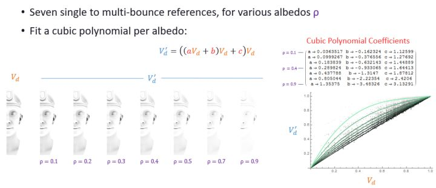

### 光照贴图和天光

```glsl
float3 DiffuseIndirectLighting;
float3 SubsurfaceIndirectLighting;	//Defaultlit也需要计算SubsurfaceIndirectLighting，但是SubsurfaceColor=0，不起作用。

//SH计算天光、体积光、点光的间接光照。采样LightMap。还有一部分与半透明前向着色，顶点雾化相关的代码
//DiffuseDir就是环境法线
GetPrecomputedIndirectLightingAndSkyLight(MaterialParameters, Interpolants, BasePassInterpolants, LightmapVTPageTableResult, GBuffer, DiffuseDir, VolumetricLightmapBrickTextureUVs, DiffuseIndirectLighting, SubsurfaceIndirectLighting, IndirectIrradiance);

// 屏幕空间间接光照遮蔽，数据来自IndirectOcclusionTexture
float IndirectOcclusion = 1.0f;
float2 NearestResolvedDepthScreenUV = 0;
float DirectionalLightShadow = 1.0f;

#if FORWARD_SHADING && (MATERIALBLENDING_SOLID || MATERIALBLENDING_MASKED)	
   //MATERIALBLENDING_SOLID对应的是Opaque Mode，MATERIALBLENDING_MASKED对应的是AlphaTest
			float2 NDC = MaterialParameters.ScreenPosition.xy / MaterialParameters.ScreenPosition.w;
			float2 ScreenUV = NDC * ResolvedView.ScreenPositionScaleBias.xy + ResolvedView.ScreenPositionScaleBias.wz;
			//Resolve次像素的最小Depth，Located in ForwardLightingCommon.ush
			NearestResolvedDepthScreenUV = CalculateNearestResolvedDepthScreenUV(ScreenUV, MaterialParameters.ScreenPosition.w);
			//从IndirectOcclusionTexture获取，并对角色进行特殊处理以减少遮蔽。  Located in ForwardLightingCommon.ush
			IndirectOcclusion = GetIndirectOcclusion(NearestResolvedDepthScreenUV, GBuffer);
			DiffuseIndirectLighting *= IndirectOcclusion;
			SubsurfaceIndirectLighting *= IndirectOcclusion;
			IndirectIrradiance *= IndirectOcclusion;
#endif

//最终环境漫反射
DiffuseColor += (DiffuseIndirectLighting * DiffuseColorForIndirect + SubsurfaceIndirectLighting * SubsurfaceColor) * AOMultiBounce( GBuffer.BaseColor, DiffOcclusion );
```

### 透明物体顶点光照

```glsl
Color += BasePassInterpolants.VertexDiffuseLighting * GBuffer.DiffuseColor;
```

### 前向渲染（直接光照）

```glsl
uint GridIndex = 0;

			#if FEATURE_LEVEL >= FEATURE_LEVEL_SM5
				GridIndex = ComputeLightGridCellIndex((uint2)(MaterialParameters.SvPosition.xy * View.LightProbeSizeRatioAndInvSizeRatio.zw - ResolvedView.ViewRectMin.xy), MaterialParameters.SvPosition.w, EyeIndex);
			//EyeIndex用于VR渲染，其他情况下为0
				#if FORWARD_SHADING || TRANSLUCENCY_LIGHTING_SURFACE_FORWARDSHADING || MATERIAL_SHADINGMODEL_SINGLELAYERWATER
					const float Dither = InterleavedGradientNoise(MaterialParameters.SvPosition.xy, View.StateFrameIndexMod8);
					FDeferredLightingSplit ForwardDirectLighting = GetForwardDirectLightingSplit(GridIndex, MaterialParameters.AbsoluteWorldPosition, MaterialParameters.CameraVector, GBuffer, NearestResolvedDepthScreenUV, MaterialParameters.PrimitiveId, EyeIndex, Dither, DirectionalLightShadow);
	
						Color += ForwardDirectLighting.DiffuseLighting.rgb;
						Color += ForwardDirectLighting.SpecularLighting.rgb;
					#endif
				#endif
			#endif
```

* 灯光剔除

UE4会把场景中的灯光按照屏幕空间分成相应的grid，类似于cluster shading的方法，注意这里的grid只考虑点光源，聚光灯，以及reflection captures，UE4这一步是通过compute shader实现的，所以只在sm>5.0的平台上有。具体shader代码在LightGridInjection.usf，阅读代码之后我们可以发现 UE4的灯光空间grid的划分是按照指数增长的。也就是每个grid的z随着距离会增长。在真正计算光照时，我们可以用GridIndex来快速决定某点是否受到灯光影响。

* 计算光照
```glsl
FDeferredLightingSplit GetForwardDirectLightingSplit(uint GridIndex, float3 WorldPosition, float3 CameraVector, FGBufferData GBufferData, float2 ScreenUV, uint PrimitiveId, uint EyeIndex, float Dither, inout float OutDirectionalLightShadow)
{
	float4 DynamicShadowFactors = 1;
    //Float4类型，保存了多张shadow，Located in ForwardLightingCommon.ush
	DynamicShadowFactors = GetForwardDynamicShadowFactors(ScreenUV);

	FDeferredLightingSplit DirectLighting;
	DirectLighting.DiffuseLighting = 0;
	DirectLighting.SpecularLighting = 0;
	float SpecularScale = 1;
	uint LightingChannelMask = GetPrimitiveData(PrimitiveId).LightingChannelMask;
	
    //获取灯光数据，EyeIndex用于VR渲染
	const FDirectionalLightData DirectionalLightData = GetDirectionalLightData(EyeIndex);
	FRectTexture RectTexture = InitRectTexture(ForwardLightData.DummyRectLightSourceTexture);

	BRANCH
	if (DirectionalLightData.HasDirectionalLight)
	{
		FDeferredLightData LightData = (FDeferredLightData)0;
		LightData.Color = DirectionalLightData.DirectionalLightColor;
		LightData.FalloffExponent = 0;
		LightData.Direction = DirectionalLightData.DirectionalLightDirection;
		LightData.DistanceFadeMAD = DirectionalLightData.DirectionalLightDistanceFadeMAD;
		LightData.bRadialLight = false;
		LightData.SpecularScale = SpecularScale;

		LightData.ShadowedBits = (DirectionalLightData.DirectionalLightShadowMapChannelMask & 0xFF) != 0 ? 1 : 0;
		// Static shadowing uses ShadowMapChannel, dynamic shadows are packed into light attenuation using PreviewShadowMapChannel
		//ShadowMapChannelMask记录了该光源在ShadowMap使用的通道
        //DirectionalLightShadowMapChannelMask的前四位用于static shadow，后四位用于dynamic shadow
        LightData.ShadowMapChannelMask = UnpackShadowMapChannelMask(DirectionalLightData.DirectionalLightShadowMapChannelMask);
        
			float4 PreviewShadowMapChannelMask = UnpackShadowMapChannelMask(DirectionalLightData.DirectionalLightShadowMapChannelMask >> 4);		//从多通道shadowmap中提取该光源对应的一个通道
			float DynamicShadowing = dot(PreviewShadowMapChannelMask, DynamicShadowFactors);

			// In the forward shading path we can't separate per-object shadows from CSM, since we only spend one light attenuation channel per light
			// If CSM is enabled (distance fading to precomputed shadowing is active), treat all of our dynamic shadowing as whole scene shadows that will be faded out at the max CSM distance
			// If CSM is not enabled, allow our dynamic shadowing to coexist with precomputed shadowing
			float PerObjectShadowing = LightData.DistanceFadeMAD.y < 0.0f ? 1.0f : DynamicShadowing;
			float WholeSceneShadowing = LightData.DistanceFadeMAD.y < 0.0f ? DynamicShadowing : 1.0f;
			//四个通道存储LightAttenuation。开启CSM使用摄影机距离插值方法，关闭CSM使用相乘方法
        	//实现函数GetShadowTerms, Located in DeferredLightingCommon.ush
        	//x:与静态阴影插值的动态阴影
        	//y:sss与静态阴影插值的动态阴影
        	//z:与静态阴影相乘的动态阴影
        	//w:sss与静态阴影相乘的动态阴影
			float4 LightAttenuation = float4(WholeSceneShadowing.xx, PerObjectShadowing.xx);

		FDeferredLightingSplit NewLighting = GetDynamicLightingSplit(WorldPosition, -CameraVector, GBufferData, 1, GBufferData.ShadingModelID, LightData, LightAttenuation, Dither, uint2(0,0), RectTexture, OutDirectionalLightShadow);

		FLATTEN
		if ((DirectionalLightData.DirectionalLightShadowMapChannelMask >> 8) & LightingChannelMask)
		{
			DirectLighting.DiffuseLighting += NewLighting.DiffuseLighting;
			DirectLighting.SpecularLighting += NewLighting.SpecularLighting;
		}
	}
```

这部分代码主要是处理阴影，接下来使用LOOP计算其他类型光源。真正计算光照的代码是GetDynamicLightingSplit。这个函数可用于前向渲染、延迟渲染，也可用于各种光源类型。这部分内容放在延迟渲染部分。

### 前向渲染（IBL）

```glsl
#if !(MATERIAL_SINGLE_SHADINGMODEL && MATERIAL_SHADINGMODEL_HAIR) && (!MATERIAL_SHADINGMODEL_SINGLELAYERWATER || FORWARD_SHADING)
				if (GBuffer.ShadingModelID != SHADINGMODELID_HAIR)
				{
					int SingleCaptureIndex = GetPrimitiveData(MaterialParameters.PrimitiveId).SingleCaptureIndex;

					half3 ReflectionColor = GetImageBasedReflectionLighting(MaterialParameters, GBuffer.Roughness, GBuffer.SpecularColor, IndirectIrradiance, GridIndex, SingleCaptureIndex, EyeIndex)
						* IndirectOcclusion
						* AOMultiBounce(GBuffer.SpecularColor, SpecOcclusion);

					#if MATERIAL_SHADINGMODEL_THIN_TRANSLUCENT
						ColorSeparateSpecular += ReflectionColor;
					#else
						Color += ReflectionColor;
					#endif
				}
			#endif
```

IBL属于间接光照，所以对乘了IndirectOcclusion和AOMultiBounce，上文提到前者是对间接光照的遮蔽，后者是减弱遮蔽效果，模拟多次反弹。

```glsl
//Located in ReflectionEnvironmentComposite.ush，仅摘取重要代码
float3 CompositeReflectionCapturesAndSkylight(
	float CompositeAlpha, 
	float3 WorldPosition, 
	float3 RayDirection, 
	float Roughness, 
	float IndirectIrradiance, 
	float IndirectSpecularOcclusion,
	float3 ExtraIndirectSpecular,
	uint NumCapturesAffectingTile,
	uint CaptureDataStartIndex, 
	int SingleCaptureIndex,
	bool bCompositeSkylight,
	uint EyeIndex)
{
    //粗糙度作为mip等级
	float Mip = ComputeReflectionCaptureMipFromRoughness(Roughness, View.ReflectionCubemapMaxMip);
	float4 ImageBasedReflections = float4(0, 0, 0, CompositeAlpha);
	float2 CompositedAverageBrightness = float2(0.0f, 1.0f);
	float4 Sample = ReflectionStruct.ReflectionCubemap.SampleLevel(ReflectionStruct.ReflectionCubemapSampler, float4(ProjectedCaptureVector, CaptureArrayIndex), Mip);

	Sample.rgb *= CaptureProperties.r;
	Sample *= DistanceAlpha;
	ImageBasedReflections = float4(Sample.rgb, 1 - Sample.a);

	// Apply indirect lighting scale while we have only accumulated reflection captures
	ImageBasedReflections.rgb *= View.IndirectLightingColorScale;
	CompositedAverageBrightness.x *= Luminance( View.IndirectLightingColorScale );


	return ImageBasedReflections.rgb;
}
```

IBL包含反射探头和天光两部分。对球面和立方体探头分别计算反射方向，使用LOOP处理多个反射探头，用平均亮度进行混合。

天光部分由GetSkyLightReflection（ReflectionEnvironmentShaders.usf）获得，还会与lightmap混合。

### 前向渲染（FullyRough）

```glsl
#if SIMPLE_FORWARD_DIRECTIONAL_LIGHT && !MATERIAL_SHADINGMODEL_SINGLELAYERWATER && !MATERIAL_SHADINGMODEL_THIN_TRANSLUCENT

			float3 DirectionalLighting = GetSimpleForwardLightingDirectionalLight(
				GBuffer,
				DiffuseColorForIndirect,
				GBuffer.SpecularColor,
				GBuffer.Roughness,
				MaterialParameters.WorldNormal, 
				MaterialParameters.CameraVector);
			
			#if STATICLIGHTING_SIGNEDDISTANCEFIELD
				DirectionalLighting *= GBuffer.PrecomputedShadowFactors.x;
			#elif PRECOMPUTED_IRRADIANCE_VOLUME_LIGHTING
				DirectionalLighting *= GetVolumetricLightmapDirectionalLightShadowing(VolumetricLightmapBrickTextureUVs);
			#elif CACHED_POINT_INDIRECT_LIGHTING
				DirectionalLighting *= IndirectLightingCache.DirectionalLightShadowing;
			#endif
			
			Color += DirectionalLighting;

		#endif
```

由于之前已将 Specular Color 合并到 Diffuse Color，FullyRough 只计算 Lambert ，但还是和其他着色模型一样调用 IntegrateBxDF

### 雾效

#### 高度雾 

顶点高度雾直接使用插值结果。像素高度雾使用CalculateHeightFog（HeightFogCommon.ush）

#### 体积雾

CombineVolumetricFog（HeightFogCommon.ush）

#### 雾的大气效果

GetAerialPerspectiveLuminanceTransmittanceWithFogOver（SkyAtmosphereCommon.ush）

#### 云体雾

GetCloudLuminanceTransmittanceOverFog（VolumetricCloudCommon.ush）

#### 体积光

GetTranslucencyVolumeLighting（BasePassPixelShader.usf）

### 自发光

```glsl
half3 Emissive = GetMaterialEmissive(PixelMaterialInputs);
```

### 颜色输出

```glsl
//颜色输出
#if MATERIAL_OUTPUT_OPACITY_AS_ALPHA
	Out.MRT[0] = half4(Color, Opacity);
#else
	Out.MRT[0] = half4(Color, 0);
#endif

//编码到GBuffer
 EncodeGBuffer(GBuffer, Out.MRT[1], Out.MRT[2], Out.MRT[3], OutGBufferD, OutGBufferE, OutVelocity, QuantizationBias);

//之后还会将速度写入MRT
```

GBuffer可能用不同的结构。一个常见的案例是5纹理GBuffer，A到E. `GBufferA.rgb = World Normal`，`PerObjectGBufferData`填充alpha通道。`GBufferB.rgba = Metallic, Specular, Roughness, ShadingModelID`。`GBufferC.rgb`是`BaseColor`与`GBufferAO`填充alpha通道。`GBufferD`专用于自定义数据，`GBufferE`适用于预先计算的阴影因子。编码GBuffer函数： EncodeGBuffer，解码函数：DecodeGBufferData（DefferredShadingCommon.ush）

## DeferredLightVertexShaders

延迟渲染的顶点着色阶段会为各种光源生成几何体

### 平行光（绘制长方形）

```glsl
void DirectionalVertexMain(
	in float2 InPosition : ATTRIBUTE0,
	in float2 InUV       : ATTRIBUTE1,
	out float2 OutTexCoord : TEXCOORD0,
	out float3 OutScreenVector : TEXCOORD1,
	out float4 OutPosition : SV_POSITION
	)
{	
	DrawRectangle(float4(InPosition.xy, 0, 1), InUV, OutPosition, OutTexCoord);
	OutScreenVector = mul(float4(OutPosition.xy, 1, 0), View.ScreenToTranslatedWorld).xyz;
}
```

### 点光源、聚光灯（近似几何体）

输入一个顶点ID，在顶点着色器中计算该顶点的世界坐标。整个顶点着色阶段会生成光源形状的模型，像素阶段使用这个模型渲染灯光。

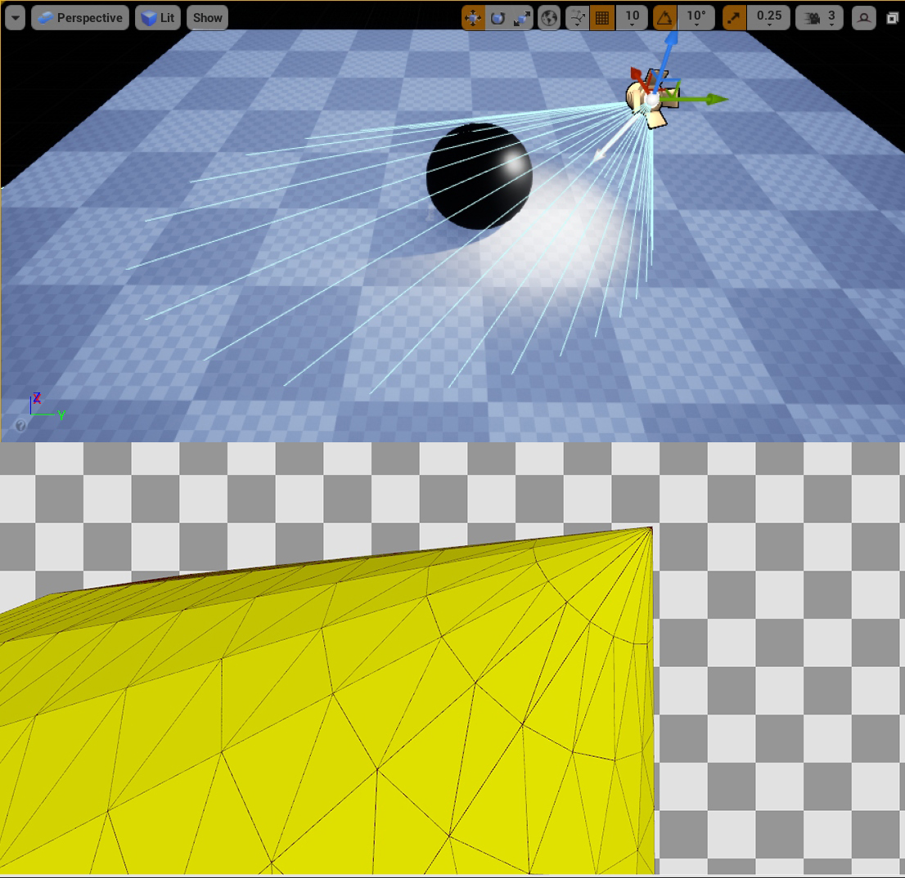

## DeferredLightPixelShaders.usf

### 获取屏幕数据

```glsl
FScreenSpaceData ScreenSpaceData = GetScreenSpaceData(InputParams.ScreenUV);

//Located in DeferredShadingCommon.ush
FScreenSpaceData GetScreenSpaceData(float2 UV, bool bGetNormalizedNormal = true)
{
	FScreenSpaceData Out;
    //获取GBuffer
	Out.GBuffer = GetGBufferData(UV, bGetNormalizedNormal);
    //获取屏幕空间AO
	float4 ScreenSpaceAO = Texture2DSampleLevel(SceneTexturesStruct.ScreenSpaceAOTexture, SceneTexturesStruct_ScreenSpaceAOTextureSampler, UV, 0);
	Out.AmbientOcclusion = ScreenSpaceAO.r;
	return Out;
}

//Located in DeferredShadingCommon.ush
FGBufferData GetGBufferData(float2 UV, bool bGetNormalizedNormal = true)
{
	float4 GBufferA = Texture2DSampleLevel(SceneTexturesStruct.GBufferATexture, SceneTexturesStruct_GBufferATextureSampler, UV, 0);
	float4 GBufferB = Texture2DSampleLevel(SceneTexturesStruct.GBufferBTexture, SceneTexturesStruct_GBufferBTextureSampler, UV, 0);
	float4 GBufferC = Texture2DSampleLevel(SceneTexturesStruct.GBufferCTexture, SceneTexturesStruct_GBufferCTextureSampler, UV, 0);
	float4 GBufferD = Texture2DSampleLevel(SceneTexturesStruct.GBufferDTexture, SceneTexturesStruct_GBufferDTextureSampler, UV, 0);
	//采样CustomDepth
    float CustomNativeDepth = Texture2DSampleLevel(SceneTexturesStruct.CustomDepthTexture, SceneTexturesStruct_CustomDepthTextureSampler, UV, 0).r;
	
    //采样CustomStencil
	int2 IntUV = (int2)trunc(UV * View.BufferSizeAndInvSize.xy);
	uint CustomStencil = SceneTexturesStruct.CustomStencilTexture.Load(int3(IntUV, 0)) STENCIL_COMPONENT_SWIZZLE;

	#if ALLOW_STATIC_LIGHTING	//静态光
		float4 GBufferE = Texture2DSampleLevel(SceneTexturesStruct.GBufferETexture, SceneTexturesStruct_GBufferETextureSampler, UV, 0);
	#else
		float4 GBufferE = 1;
	#endif
	
    //获取切线
	float4 GBufferF = Texture2DSampleLevel(SceneTexturesStruct.GBufferFTexture, SceneTexturesStruct_GBufferFTextureSampler, UV, 0);

	#if WRITES_VELOCITY_TO_GBUFFER
		float4 GBufferVelocity = Texture2DSampleLevel(SceneTexturesStruct.GBufferVelocityTexture, SceneTexturesStruct_GBufferVelocityTextureSampler, UV, 0);
	#else
		float4 GBufferVelocity = 0;
	#endif

    //采样SceneDepthTexture
	float SceneDepth = CalcSceneDepth(UV);
	
    //以上数据组成结构体 Located in DeferredShadingCommon.ush
	return DecodeGBufferData(GBufferA, GBufferB, GBufferC, GBufferD, GBufferE, GBufferF, GBufferVelocity, CustomNativeDepth, CustomStencil, SceneDepth, bGetNormalizedNormal, CheckerFromSceneColorUV(UV));
}
```

解码GBuffer的过程是从GBuffer纹理中采样数据，二次加工并存储到FGBufferData中，然后FGBufferData的实例又存储到FScreenSpaceData中。以便后续的光照计算中直接访问。

### 计算光照

#### 光照函数入口

```glsl
FDeferredLightData LightData = SetupLightDataForStandardDeferred();
		float Dither = InterleavedGradientNoise(InputParams.PixelPos, View.StateFrameIndexMod8 );
		FRectTexture RectTexture = InitRectTexture(DeferredLightUniforms.SourceTexture);
		float SurfaceShadow = 1.0f;
		//动态光照入口
		const float4 Radiance = GetDynamicLighting(DerivedParams.WorldPosition, DerivedParams.CameraVector, ScreenSpaceData.GBuffer, ScreenSpaceData.AmbientOcclusion, ScreenSpaceData.GBuffer.ShadingModelID, LightData, GetPerPixelLightAttenuation(InputParams.ScreenUV), Dither, uint2(InputParams.PixelPos), RectTexture, SurfaceShadow);
		//光源衰减系数
		const float  Attenuation = ComputeLightProfileMultiplier(DerivedParams.WorldPosition, DeferredLightUniforms.Position, -DeferredLightUniforms.Direction, DeferredLightUniforms.Tangent);

		OutColor += (Radiance * Attenuation);
```

#### 动态光照准备

```glsl
FDeferredLightingSplit GetDynamicLightingSplit(
	float3 WorldPosition, float3 CameraVector, FGBufferData GBuffer, float AmbientOcclusion, uint ShadingModelID, 
	FDeferredLightData LightData, float4 LightAttenuation, float Dither, uint2 SVPos, FRectTexture SourceTexture,
	inout float SurfaceShadow)
{
    //漫反射的高光分别存到FLightAccumulator，返回时分离。对次表面材质做了特殊处理
	FLightAccumulator LightAccumulator = (FLightAccumulator)0;

	float3 V = -CameraVector;
	float3 N = GBuffer.WorldNormal;
	
	float3 L = LightData.Direction;	// Already normalized
	float3 ToLight = L;
	
	float LightMask = 1;
	if (LightData.bRadialLight)
	{
		LightMask = GetLocalLightAttenuation( WorldPosition, LightData, ToLight, L );
	}
    //成本估计，推测用于编辑器的shader complexit
	LightAccumulator.EstimatedCost += 0.3f;		// running the PixelShader at all has a cost
	
    //跳过光照强度小于0的光源
	BRANCH
	if( LightMask > 0 )
	{
        //计算阴影
		FShadowTerms Shadow;
		Shadow.SurfaceShadow = AmbientOcclusion;
		GetShadowTerms(GBuffer, LightData, WorldPosition, L, LightAttenuation, Dither, Shadow);
		SurfaceShadow = Shadow.SurfaceShadow;

		LightAccumulator.EstimatedCost += 0.3f;		// add the cost of getting the shadow terms
		
        //如果阴影是全黑跳过光照计算
		BRANCH
		if( Shadow.SurfaceShadow + Shadow.TransmissionShadow > 0 )
		{
			float3 LightColor = LightData.Color;
		
         //没有平行光时，只计算漫反射
		#if NON_DIRECTIONAL_DIRECT_LIGHTING
			float Lighting;
            //矩形光
			if( LightData.bRectLight )
			{
				FRect Rect = GetRect( ToLight, LightData );
				Lighting = IntegrateLight( Rect, SourceTexture);
			}
			else
			{	//胶囊灯
				FCapsuleLight Capsule = GetCapsule( ToLight, LightData );
				Lighting = IntegrateLight( Capsule, LightData.bInverseSquared );
			}

			float3 LightingDiffuse = Diffuse_Lambert( GBuffer.DiffuseColor ) * Lighting;
			LightAccumulator_AddSplit(LightAccumulator, LightingDiffuse, 0.0f, 0, LightColor * LightMask * Shadow.SurfaceShadow, bNeedsSeparateSubsurfaceLightAccumulation);
		#else
            //有平行光时
			FDirectLighting Lighting;
			if (LightData.bRectLight)
			{
				FRect Rect = GetRect( ToLight, LightData );
				#if REFERENCE_QUALITY
					Lighting = IntegrateBxDF( GBuffer, N, V, Rect, Shadow, SourceTexture, SVPos );
				#else
					Lighting = IntegrateBxDF( GBuffer, N, V, Rect, Shadow, SourceTexture);
				#endif
			}
			else
			{
				FCapsuleLight Capsule = GetCapsule( ToLight, LightData );

				#if REFERENCE_QUALITY
					Lighting = IntegrateBxDF( GBuffer, N, V, Capsule, Shadow, SVPos );
				#else
					Lighting = IntegrateBxDF( GBuffer, N, V, Capsule, Shadow, LightData.bInverseSquared );
				#endif
			}

			Lighting.Specular *= LightData.SpecularScale;
			LightAccumulator_AddSplit( LightAccumulator, Lighting.Diffuse, Lighting.Specular, Lighting.Diffuse, LightColor * LightMask * Shadow.SurfaceShadow, bNeedsSeparateSubsurfaceLightAccumulation );
			LightAccumulator_AddSplit( LightAccumulator, Lighting.Transmission, 0.0f, Lighting.Transmission, LightColor * LightMask * Shadow.TransmissionShadow, bNeedsSeparateSubsurfaceLightAccumulation );

			LightAccumulator.EstimatedCost += 0.4f;		// add the cost of the lighting computations (should sum up to 1 form one light)
		#endif
		}
	}

	return LightAccumulator_GetResultSplit(LightAccumulator);
}

```

延迟渲染将四种灯光分为两种积分区域：矩形光（平行光、面光），胶囊光（点光、聚光灯）。根据灯光类型和REFERENCE_QUALITY一共有四个入口函数IntegrateBxDF。REFERENCE_QUALITY应该是最高质量，默认被定义为0。

这一步 四种IntegrateBxDF 仅构建积分区域 FAreaLight，之后进入同名函数 IntegrateBxDF (ShadingModels.ush)计算光照。

IntegrateBxDF 中包含各种光照模型 BRDF 的入口函数，下面以 DefaultLitBxDF (ShadingModels.ush)为例。

#### DefaultLitBxDF (ShadingModel.ush)

```glsl
FDirectLighting DefaultLitBxDF( FGBufferData GBuffer, half3 N, half3 V, half3 L, float Falloff, float NoL, FAreaLight AreaLight, FShadowTerms Shadow )
{
	BxDFContext Context;

#if SUPPORTS_ANISOTROPIC_MATERIALS
	bool bHasAnisotropy = HasAnisotropy(GBuffer.SelectiveOutputMask);
#else
	bool bHasAnisotropy = false;
#endif
	
    //初始化各种点积，各向异性需要额外的切线、副切线
	BRANCH
	if (bHasAnisotropy)
	{
		half3 X = GBuffer.WorldTangent;
		half3 Y = normalize(cross(N, X));
		Init(Context, N, X, Y, V, L);
	}
	else
	{
		Init(Context, N, V, L);
        //调整模拟区域光后的各种向量之间的点积
        //论文地址：extension://oikmahiipjniocckomdccmplodldodja/pdf-viewer/web/viewer.html?file=https%3A%2F%2Fd3ihk4j6ie4n1g.cloudfront.net%2Fdownloads%2Fassets%2FDecimaSiggraph2017.pdf%3Fmtime%3D20200402092944%26focal%3Dnone
		SphereMaxNoH(Context, AreaLight.SphereSinAlpha, true);
	}

	Context.NoV = saturate(abs( Context.NoV ) + 1e-5);
	
	FDirectLighting Lighting;
    //兰伯特漫反射
	Lighting.Diffuse  = AreaLight.FalloffColor * (Falloff * NoL) * Diffuse_Lambert( GBuffer.DiffuseColor );

	BRANCH
	if (bHasAnisotropy)
	{
		//Lighting.Specular = GBuffer.WorldTangent * .5f + .5f;
		Lighting.Specular = AreaLight.FalloffColor * (Falloff * NoL) * SpecularGGX(GBuffer.Roughness, GBuffer.Anisotropy, GBuffer.SpecularColor, Context, NoL, AreaLight);
	}
	else
	{
		if( AreaLight.bIsRect )
		{
            //多边形光源反射 论文地址 https://eheitzresearch.wordpress.com/415-2/
			Lighting.Specular = RectGGXApproxLTC(GBuffer.Roughness, GBuffer.SpecularColor, N, V, AreaLight.Rect, AreaLight.Texture);
		}
		else
		{
			Lighting.Specular = AreaLight.FalloffColor * (Falloff * NoL) * SpecularGGX(GBuffer.Roughness, GBuffer.SpecularColor, Context, NoL, AreaLight);
		}
	}

	Lighting.Transmission = 0;
	return Lighting;
}

```

#### SpecularGGX (ShadingModel.ush)

```glsl
float3 SpecularGGX( float Roughness, float3 SpecularColor, BxDFContext Context, float NoL, FAreaLight AreaLight )
{
    //Roughness贴图的数据平方得到真正的粗糙度a，再平方得到a^2
	float a2 = Pow4( Roughness );
    
    //归一化系数，使半球面积分为1
	float Energy = EnergyNormalization( a2, Context.VoH, AreaLight );
	
	// Generalized microfacet specular
	float D = D_GGX( a2, Context.NoH ) * Energy;
	float Vis = Vis_SmithJointApprox( a2, Context.NoV, NoL );
	float3 F = F_Schlick( SpecularColor, Context.VoH );

	return (D * Vis) * F;
}
```

#### Lambert & FDG (BRDF.ush)

```glsl
float3 Diffuse_Lambert( float3 DiffuseColor )
{
	return DiffuseColor * (1 / PI);
}

// [Schlick 1994, "An Inexpensive BRDF Model for Physically-Based Rendering"]
float3 F_Schlick( float3 SpecularColor, float VoH )
{
	float Fc = Pow5( 1 - VoH );					// 1 sub, 3 mul
	//return Fc + (1 - Fc) * SpecularColor;		// 1 add, 3 mad
	// Anything less than 2% is physically impossible and is instead considered to be shadowing
	return saturate( 50.0 * SpecularColor.g ) * Fc + (1 - Fc) * SpecularColor;
}

// [Walter et al. 2007, "Microfacet models for refraction through rough surfaces"]
float D_GGX( float a2, float NoH )
{
	float d = ( NoH * a2 - NoH ) * NoH + 1;	// 2 mad
	return a2 / ( PI*d*d );					// 4 mul, 1 rcp
}

// [Heitz 2014, "Understanding the Masking-Shadowing Function in Microfacet-Based BRDFs"]
float Vis_SmithJointApprox( float a2, float NoV, float NoL )
{
	float a = sqrt(a2);
    //入射方向遮蔽、初涉方向遮蔽
	float Vis_SmithV = NoL * ( NoV * ( 1 - a ) + a );
	float Vis_SmithL = NoV * ( NoL * ( 1 - a ) + a );
	return 0.5 * rcp( Vis_SmithV + Vis_SmithL );
}
```

