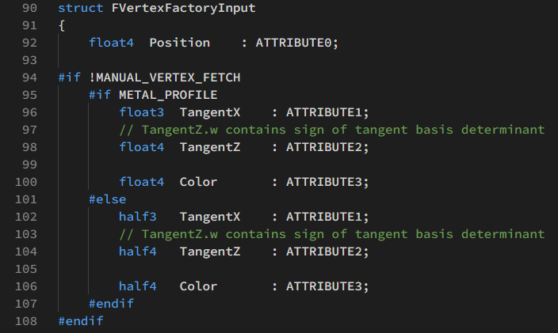
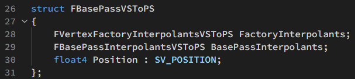
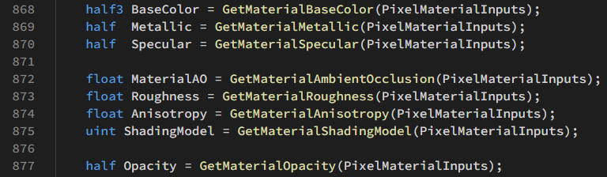
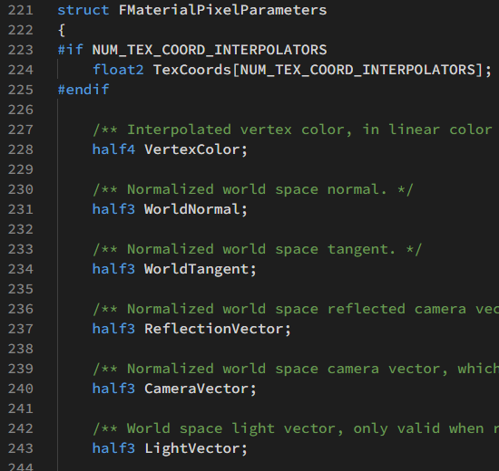
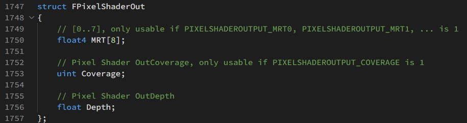
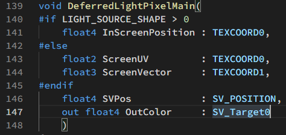
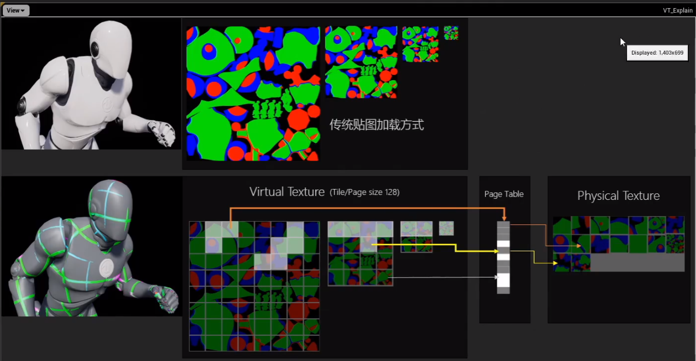

# UE4 着色器概述
基于 Unreal 4.26
[toc]


## 数据传递

### 材质编辑器->着色器

#### SceneTypes.h

* 枚举类型 EMaterialProperty包含了材质编辑器可传递的属性。

#### Material.cpp

* 实现方法 UMaterial::IsPropertyActiveInDerived，在该函数中判断当前ShadingModel需要在材质编辑器中激活哪些pin。
* 实现方法 FMaterialResource::CompilePropertyAndSetMaterialProperty ，将材质属性传递给材质编译器FMaterialCompiler。FMaterialCompiler完成shader代码的拼装。

#### MaterialShaderType.h

* c++到shader的绑定宏IMPLEMENT_MATERIAL_SHADER_TYPE

### 顶点着色器

#### 输入数据 LocalVertexFactory.ush

FVertexFactoryInput这个数据结构是来自C++端的数据输入



#### 输出数据 BasePassVertexCommon.ush
FBasePassVSOutput 有两种定义。开启曲面细分会使用 FBasePassVSToDS ，进入DS着色器。否则使用FBasePassVSToPS， 进入PS着色器。

FBasePassVSToPS 有两个嵌套的结构



FVertexFactoryInterpolantsVSToPS 定义在各个顶点工厂的 .ush 文件中。UE4中有很多VertexFactory用来处理不同网格类型，每种VertexFactory都有自己的输出结构的函数，供顶点着色器调用。例如，在LocalVertexFactoryCommon.ush可以找到输出结构的定义。

FBasePassInterpolantsVSToPS 在 BasePassCommon.ush 重定义为 FSharedBasePassInterpolants。

### 像素着色器

像素着色器有三部分输入：顶点着色器、材质编辑器、系统变量。其中来自顶点着色器和系统变量合并为 MaterialParameters 。

可输出到MRT、GBuffer、SV_Target。

#### 顶点着色器输入 

Common.ush： FPixelShaderIn

BasePassVertexCommon.ush： FVertexFactoryInterpolantsVSToPS

BasePassVertexCommon.ush： FBasePassInterpolantsVSToPS

#### 材质编辑器输入 MaterialTemplate.ush

材质编辑器会用拼装好的shader代码替换 %s


在 BasePassPixelShader.usf 中读取这些属性



#### 材质参数输入   MaterialTemplate.ush

FMaterialPixelParameters包含了像素着色器所需的其他数据



#### 输出结构 Common.ush

在前向渲染中，BasePassPixelShader.usf会将最终计算的颜色输出到 FPixelShaderOut.MRT[0]



#### 写入GBuffer  BasePassPixelShader.usf


#### 延迟光照输出 DeferredLightPixelShaders.usf

延迟光照输出到SV_Target0，完成渲染。



## BasePassVertexShader

### 获取世界空间坐标（未偏移）

```glsl
float4 WorldPositionExcludingWPO = VertexFactoryGetWorldPosition(Input, VFIntermediates);
float4 WorldPosition = WorldPositionExcludingWPO;
```

### 局部空间切线

```glsl
float3x3 TangentToLocal = VertexFactoryGetTangentToLocal(Input, VFIntermediates);
```

### 获取世界坐标偏移

```glsl
WorldPosition.xyz += GetMaterialWorldPositionOffset(VertexParameters);
```

### 计算剪裁空间坐标

```glsl
float4 RasterizedWorldPosition = VertexFactoryGetRasterizedWorldPosition(Input, VFIntermediates, WorldPosition);
ClipSpacePosition = INVARIANT(mul(RasterizedWorldPosition, ResolvedView.TranslatedWorldToClip));
Output.Position = INVARIANT(ClipSpacePosition);
```

### 计算顶点雾

```glsl
#if BASEPASS_ATMOSPHERIC_FOG
Output.BasePassInterpolants.VertexFog = CalculateVertexAtmosphericFog(WorldPosition.xyz, ResolvedView.TranslatedWorldCameraOrigin);
#else
Output.BasePassInterpolants.VertexFog = CalculateHeightFog(WorldPosition.xyz - ResolvedView.TranslatedWorldCameraOrigin);
#endif
```

### 透明物体顶点光照

```glsl
#if TRANSLUCENCY_ANY_PERVERTEX_LIGHTING
float3 WorldPositionForVertexLightingTranslated = VertexFactoryGetPositionForVertexLighting(Input, VFIntermediates, WorldPosition.xyz);
float3 WorldPositionForVertexLighting = WorldPositionForVertexLightingTranslated - ResolvedView.PreViewTranslation.xyz;
#endif
```

透明物体的两种逐顶点光照: TRANSLUCENCY_PERVERTEX_LIGHTING_VOLUME 和 TRANSLUCENCY_PERVERTEX_FORWARD_SHADING

### 其他部分

预计算体积光照

速度缓冲

## BasePassPixelShader

### 获取材质参数（MaterialParameters）、材质编辑器数据（PixelMaterialInputs）

```glsl
FMaterialPixelParameters MaterialParameters = GetMaterialPixelParameters(Interpolants, In.SvPosition);
FPixelMaterialInputs PixelMaterialInputs;
```

### 光照虚拟纹理

```glsl
float2 LightmapUV0, LightmapUV1;
uint LightmapDataIndex;
GetLightMapCoordinates(Interpolants, LightmapUV0, LightmapUV1, LightmapDataIndex);
LightmapVTPageTableResult = LightmapGetVTSampleInfo(LightmapUV0, LightmapDataIndex, In.SvPosition.xy);
```

> 支持虚拟纹理光照贴图可提高光照贴图烘焙的流送性能和质量。虚拟纹理可以分区域加载不同mipmap等级。虚拟纹理的最大mipmap等级由分区最小分辨率决定。由于虚拟纹理采用了随机三线性过滤，高频纹理会出现雪花噪点。
>
> 在 项目设置（Project Settings） 中的 引擎（Engine） > **渲染（Rendering）** 下，设置 启用虚拟纹理光照贴图（Enable virtual texture lightmaps），以启用对光照贴图的虚拟纹理支持。
>
> 

### 采样光照图AO

```glsl
float2 LightmapUV0, LightmapUV1;
uint LightmapDataIndex;
GetLightMapCoordinates(Interpolants, LightmapUV0, LightmapUV1, LightmapDataIndex);
MaterialParameters.AOMaterialMask = GetAOMaterialMask(LightmapVTPageTableResult, LightmapUV0 * float2(1, 2), LightmapDataIndex, In.SvPosition.xy);		//为什么要乘float2(1,2)？
```

### 计算额外参数（GetMaterialPixelParameters没有获取的）

TranslatedWorldPosition是camera空间坐标 -CameraVector

```glsl
float4 ScreenPosition = SvPositionToResolvedScreenPosition(In.SvPosition);
float3 TranslatedWorldPosition = SvPositionToResolvedTranslatedWorld(In.SvPosition);
CalcMaterialParametersEx(MaterialParameters, PixelMaterialInputs, In.SvPosition, ScreenPosition, In.bIsFrontFace, TranslatedWorldPosition, TranslatedWorldPosition);
```

### 像素深度偏移

```glsl
ApplyPixelDepthOffsetForBasePass(MaterialParameters, PixelMaterialInputs, BasePassInterpolants, Out.Depth);
```

应用材质编辑器中的Pixel Depth Offset。在BasePass中只会应用到VelocityPrevScreenPosition，VelocityScreenPosition，不会应用到Depth

### 像素clip

```glsl
#if !EARLY_Z_PASS_ONLY_MATERIAL_MASKING
	if (!bEditorWeightedZBuffering)
	{
	#if MATERIALBLENDING_MASKED_USING_COVERAGE
		Out.Coverage = DiscardMaterialWithPixelCoverage(MaterialParameters, PixelMaterialInputs);
	#else
		GetMaterialCoverageAndClipping(MaterialParameters, PixelMaterialInputs);
	#endif
	}
#endif
```

Alpha to Coverage就是在Alpha Test的基础上对其边缘进行一个平滑。原理是与MSAA配合，对子像素计算平均Coverage。每个fragment有一个coverage值，这个值是一个bitmask，比如4X就是4位，每一位记录了这个fragment在这个子像素区域是否覆盖了。resolve时将平均Coverage乘以输出颜色。

GetMaterialCoverageAndClipping中包含了直接剔除和透明度抖动两种方法。

### 获取材质编辑器参数

```glsl
half3 BaseColor = GetMaterialBaseColor(PixelMaterialInputs);
half  Metallic = GetMaterialMetallic(PixelMaterialInputs);
half  Specular = GetMaterialSpecular(PixelMaterialInputs);

float MaterialAO = GetMaterialAmbientOcclusion(PixelMaterialInputs);
float Roughness = GetMaterialRoughness(PixelMaterialInputs);
float Anisotropy = GetMaterialAnisotropy(PixelMaterialInputs);
uint ShadingModel = GetMaterialShadingModel(PixelMaterialInputs);

half Opacity = GetMaterialOpacity(PixelMaterialInputs);
```

### 次表面散射

