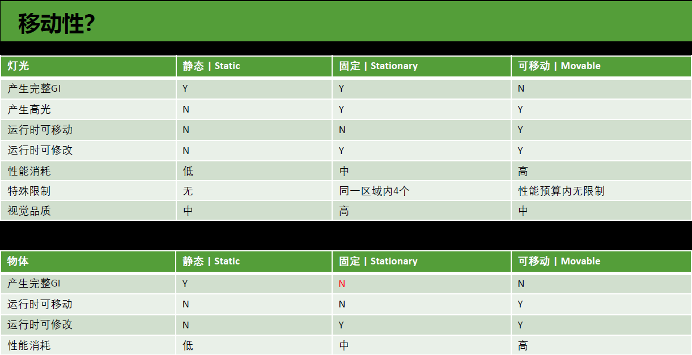

[toc]

# 移动性和烘培

## 光源移动性

|              | Static Light                   | Stationary Light | Movable Light  |
| ------------ | ------------------------------ | ---------------- | -------------- |
| 静态物体阴影 | 静态阴影                       | 静态阴影         | 实时阴影       |
| 动态物体阴影 | 无阴影                         | 实时阴影         | 实时阴影       |
| 高光         | 无高光（需要Reflection Probe） | 有高光           | 有高光         |
| GI           | 烘培GI                         | 烘培GI           | 无GI           |
| 不可移动     | 不可调整                       | 不可移动，可调整 | 可移动，可调整 |

## 物体移动性

| Static Object | Stationary Object | Movable Object |
| ------------- | ----------------- | -------------- |
| 静态阴影      | 实时阴影          | 实时阴影       |
| 烘培GI        | 无GI              | 无GI           |

## Volumetric Light	

烘培体积中的静态物体GI，可用于体积中的动态物体，或提高体积中静态物体的GI质量

# 常用cmd

| cmd                  | parameter | feature    |
| -------------------- | --------- | ---------- |
| r.SetNearClipPlane   | num       | 近裁切平面 |
| r.ForceLOD           | num       | 强制LOD    |
| r.DistanceFieldAO    | 0/1       | DFAO       |
| r.SSGI.Enable        | 0/1       | SSGI       |
| r.Tonemapper.Sharpen | num       | 锐化       |

