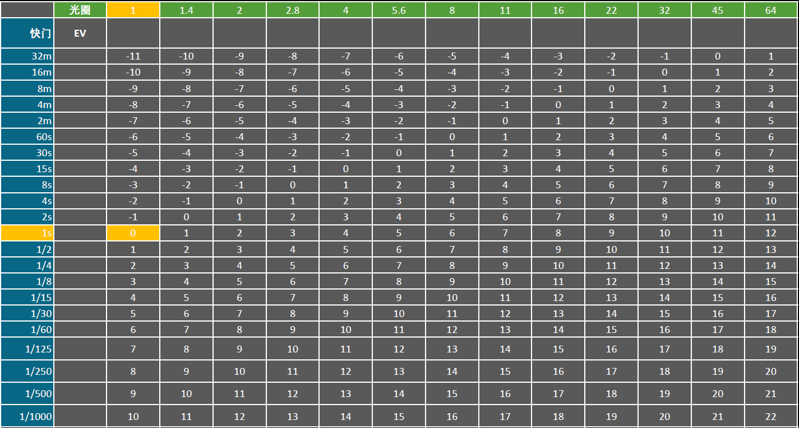

[toc]

# 移动性和烘培

## 光源移动性

|              | Static Light                   | Stationary Light | Movable Light  |
| ------------ | ------------------------------ | ---------------- | -------------- |
| 静态物体阴影 | 静态阴影                       | 静态阴影         | 实时阴影       |
| 动态物体阴影 | 无阴影                         | 实时阴影         | 实时阴影       |
| 高光         | 无高光（需要Reflection Probe） | 有高光           | 有高光         |
| GI           | 烘培GI                         | 烘培GI           | 无GI           |
| 不可移动     | 不可调整                       | 不可移动，可调整 | 可移动，可调整 |

## 物体移动性

| Static Object | Stationary Object | Movable Object |
| ------------- | ----------------- | -------------- |
| 静态阴影      | 实时阴影          | 实时阴影       |
| 烘培GI        | 无GI              | 无GI           |

## Volumetric Light	

烘培体积中的静态物体GI，可用于体积中的动态物体，或提高体积中静态物体的GI质量

# 常用cmd

| cmd                  | parameter | feature    |
| -------------------- | --------- | ---------- |
| r.SetNearClipPlane   | num       | 近裁切平面 |
| r.ForceLOD           | num       | 强制LOD    |
| r.DistanceFieldAO    | 0/1       | DFAO       |
| r.SSGI.Enable        | 0/1       | SSGI       |
| r.Tonemapper.Sharpen | num       | 锐化       |

# 色温

## 常见色温

| 色温  | 物体         |
| ----- | ------------ |
| 1700K | 火柴         |
| 1850K | 蜡烛         |
| 2800K | 白炽灯       |
| 3000K | 卤素灯       |
| 4000K | 下午阳光     |
| 4300K | 汽车大灯     |
| 5500K | 中文阳光     |
| 6420K | 氙弧灯       |
| 6500K | 标准白平衡   |
| 7000K | 阴天         |
| 8000K | 氙气灯       |
| 9300K | 老式电视屏幕 |

# 光度学

| 概念     | 单位       | 理解                                   | 虚幻                                     |
| -------- | ---------- | -------------------------------------- | ---------------------------------------- |
| 照度     | lux        | 从被照物体出发，描述被照明的物体有多亮 | 太阳光                                   |
| 发光强度 | cd         | 从光源出发，描述光源本身有多亮         | 一般灯光                                 |
| 亮度     | cd/m2, nit | 从人眼感受出发，描述“看到的”画面有多亮 | 面积灯光发光强度不变，面积越大，亮度越低 |

## 常见照度

| 环境     | Lux       |
| -------- | --------- |
| 晴天     | 100000    |
| 阴天     | 500-10000 |
| 专柜     | 750-3000  |
| 工业绘图 | 750-1500  |
| 阅读     | 500-1000  |
| 普通房间 | 300-750   |
| 暗室     | 30-75     |
| 街灯     | 5-30      |
| 满月     | 0.2       |

# 曝光值

EV(Exposure Value)，描述光圈+快门组合后的拍摄亮度

EV0：使用f/1.0光圈曝光1s，是个很敏感的值。虚幻中的GameSetting。

EV100：即ISO100，以ISO为100的胶片进行测量。

虚幻项目设置中“扩展自动曝光设置中的默认亮度范围”，就是把虚幻的曝光方式从游戏方式改为EV100的方式。

纯CG项目：以EV0作为标准，统一，方便，数值小好操作

对接实拍项目：通过lux,，cd，色温，lm，EV100等手段来对接实拍项目

