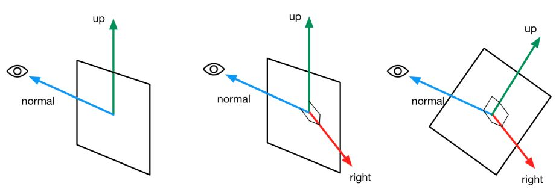

# Shader动画

## 纹理动画

### 序列帧动画

依次播放一系列关键帧图像，当播放速度达到一定数值，看起来就像连续的动画。

要播放帧动画，需要计算出每个时刻需要播放的关键帧在纹理中的位置。

```glsl
fixed4 frag(v2f i):SV_TARGET{
    float time=floor(_Time.y*_Speed);
    float row=floor(time/_HorizontalAmount);
    float column=time-row*_HorizontalAmount;    //除法结果的余数是列索引
    
    half2 uv=i.uv+half2(column,-row);
    uv.x/=_HorizontalAmount;
    uv.y/=_VerticalAmount;
    fixed4 c=tex2D(_MainTex,uv);
    c.rgb*=_Color;
    return c;
}
```

### 滚动的背景

很多2D游戏都使用了不断滚动的背景来模拟游戏角色在场景中穿梭。这些背景往往包含了多个层来模拟一种视察效果。

```glsl
v2f vert (a2v v) {
    v2f o;
    o.pos = UnityObjectToClipPos(v.vertex);
    //frac返回小数部分
    o.uv.xy = TRANSFORM_TEX(v.texcoord, _MainTex) + frac(float2(_ScrollX, 0.0) * _Time.y);
    o.uv.zw = TRANSFORM_TEX(v.texcoord, _DetailTex) + frac(float2(_Scroll2X, 0.0) * _Time.y);
    
    return o;
}

fixed4 frag (v2f i) : SV_Target {
    fixed4 firstLayer = tex2D(_MainTex, i.uv.xy);
    fixed4 secondLayer = tex2D(_DetailTex, i.uv.zw);
    //用第二层纹理的透明通道来混合两张纹理
    fixed4 c = lerp(firstLayer, secondLayer, secondLayer.a);
    c.rgb *= _Multiplier;
    
    return c;
}
```

## 顶点动画

### 流动的河流

使用正弦函数等来模拟水流的波动效果。

首先在模型空间计算顶点位移量，用 _Frequency 和 _Time.y 变量来控制正弦函数的频率。为了让不同位置具有不同的位移，对上述结果加上模型空间下的位置分量，并乘以 _InvWateLength 来控制波长。

```glsl
v2f vert(a2v v) {
    v2f o;
    float4 offset;
    offset.yzw = float3(0.0, 0.0, 0.0);
    //这里是模型空间的x轴，视具体模型而定
    //在不同位置有不同位移，加上模型空间下的位置分量
    offset.x = sin(_Frequency * _Time.y + v.vertex.x * _InvWaveLength + v.vertex.y * _InvWaveLength + v.vertex.z * _InvWaveLength) * _Magnitude;
    o.pos = UnityObjectToClipPos(v.vertex + offset);
    
    o.uv = TRANSFORM_TEX(v.texcoord, _MainTex);
    o.uv +=  float2(0.0, _Time.y * _Speed);
    
    return o;
}
```

### 广告牌

广告牌技术的本之就是构建旋转矩阵，一个变换矩阵需要三个基向量。广告牌技术使用的基向量通常就是表面法线、指向上方向、指向右方向。我们还要指定一个锚点，这个锚点在旋转过程中是固定不变的，以此来确定广告牌在空间中的位置。

通过初始计算目标的表面法线（视角方向）和指向上方向，而两者往往是不垂直的。但是两者其中之一是固定的，我们假设法线方向是固定的，根据表面法线和指向上的方向来计算出目标方向的指向右方向（通过叉积操作）。
$$
right=up \times normal
$$
对其归一化后，再由法线方向和指向右方向计算出正交的指向上方向即可。
$$
up^{'}=normal \times right
$$


```glsl
v2f vert(a2v v){
    v2f o;
    float3 center = float3(0, 0, 0);
    float3 viewer = mul(unity_WorldToObject,float4(_WorldSpaceCameraPos, 1));

    float3 normalDir=viewer-center;

    //用_VerticalBillboarding控制垂直方向上的偏移度
    normalDir.y=normalDir.y*_VerticalBillboarding;
    normalDir=normalize(normalDir);
    //计算三个正交基
    //防止法线和Up平行导致叉积错误
    float3 upDir=abs(normalDir.y)>0.999? float3(0,0,1):float3(0,1,0);
    float3 rightDir=normalize(cross(upDir,normalDir));
    upDir=normalize(cross(normalDir,rightDir));

    //计算新的顶点位置(从模型空间变换到上述正交基空间)
    float3 centerOffs=v.vertex-center;
    float3 localPos=center+rightDir*centerOffs.x+upDir*centerOffs.y+normalDir*centerOffs.z;
    o.pos=UnityObjectToClipPos(float4(localPos,1));
    o.uv=TRANSFORM_TEX(v.texcoord,_MainTex);
    return o;
}
```

