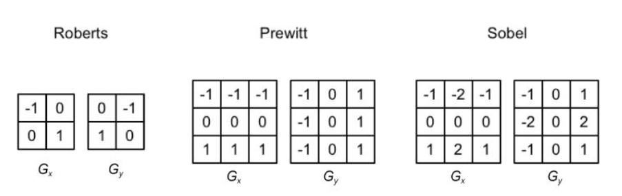
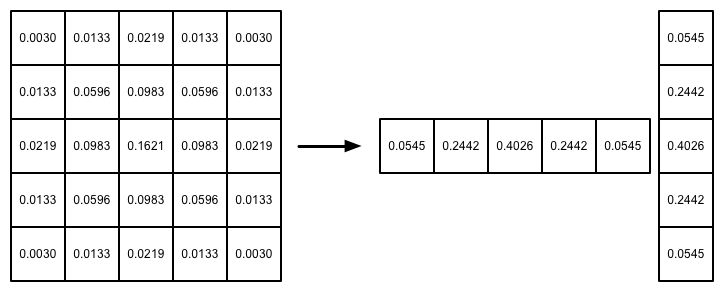

# 屏幕后处理效果

## 屏幕后处理脚本

想要实现屏幕后处理的基础在于得到渲染后的屏幕图像，即抓取屏幕，而Unity为我们提供了这样一个方便的接口——**OnRenderImage** **函数** 

```csharp
MonoBehaviour.OnRenderImage (RenderTexture src, RenderTexture dest)
```

我们首先需要在摄像中添加一个用于屏幕后处理的脚本。在这个脚本中，我们会实现OnRenderImage函数来获取当前屏幕的渲染纹理。然后，再调用Graphics.Blit函数使用特定的Unity Shader来对当前图像进行处理，再把返回的渲染纹理显示到屏幕上。对于一些复杂的屏幕特效，我们可能需要多次调用Graphics.Blit函数来对上一步的输出结果进行下一步处理。

## 调整屏幕的亮度、饱和度和对比度

定义顶点着色器。屏幕特效使用的顶点着色器代码通常都比较简单，我们只需要进行必需的顶点变换，更重要的是，我们需要把正确的纹理坐标传递给片元着色器，以便对屏幕图像进行正确的采样：

```glsl
struct v2f {
    float4 pos : SV_POSITION;
    half2 uv: TEXCOORD0;
};

v2f vert(appdata_img v) {
    v2f o;
    o.pos = mul(UNITY_MATRIX_MVP, v.vertex);
    o.uv = v.texcoord; 
    return o;
}
```

### 亮度

利用_Brightness属性来调整亮度。亮度的调整非常简单，我们只需要把原颜色乘以亮度系数_Brightness即可。然后，我们计算该像素对应的亮度值（luminance），这是通过对每个颜色分量乘以一个特定的系数再相加得到的。

### 饱和度

我们使用该亮度值创建了一个饱和度为0的颜色值，并使用_Saturation属性在其和上一步得到的颜色之间进行插值，从而得到希望的饱和度颜色。

### 对比度

首先创建一个对比度为0的颜色值（各分量均为0.5），再使用_Contrast属性在其和上一步得到的颜色之间进行插值，从而得到最终的处理结果。

```glsl
fixed4 frag(v2f i):SV_TARGET{
    fixed4 renderTex = tex2D(_MainTex, i.uv);
    //应用亮度值
    fixed3 finalColor = renderTex.rgb * _Brightness;

    //亮度值公式
    fixed luminance = 0.2125 * renderTex.r + 0.7154 * renderTex.g + 0.0721 * renderTex.b;
    //使用亮度值公式创建饱和度为0的颜色值
    fixed3 luminanceColor=fixed3(luminance,luminance,luminance);
    finalColor = lerp(luminanceColor, finalColor, _Saturation);
    //对比度
    fixed3 avgColor = fixed3(0.5, 0.5, 0.5);
    finalColor = lerp(avgColor, finalColor, _Contrast);

    return fixed4(finalColor,renderTex.a);
}
```

## 边缘检测


### 常见的边缘检测算子



整体的梯度可按下面的公式计算而得。出于性能的考虑，我们有时会使用绝对值操作来代替开根号操作。当得到梯度*G* 后，我们就可以据此来判断哪些像素对应了边缘（梯度值越大，越有可能是边缘点）。
$$
G=|G_x|+|G_y|
$$

### 实现

在顶点着色器的代码中，我们计算了边缘检测时需要的纹理坐标。我们在v2f结构体中定义了一个维数为9的纹理数组，对应了使用Sobel算子采样时需要的9个邻域纹理坐标。通过把计算采样纹理坐标的代码从片元着色器中转移到顶点着色器中，可以减少运算，提高性能。由于从顶点着色器到片元着色器的插值是线性的，因此这样的转移并不会影响纹理坐标的计算结果。

```glsl
struct v2f {
    float4 pos : SV_POSITION;
    half2 uv[9] : TEXCOORD0;
};

v2f vert(appdata_img v) {
    v2f o;
    o.pos = mul(UNITY_MATRIX_MVP, v.vertex);

    half2 uv = v.texcoord; 

    o.uv[0] = uv + _MainTex_TexelSize.xy * half2(-1, -1);
    o.uv[1] = uv + _MainTex_TexelSize.xy * half2(0, -1);
    o.uv[2] = uv + _MainTex_TexelSize.xy * half2(1, -1);
    o.uv[3] = uv + _MainTex_TexelSize.xy * half2(-1, 0);
    o.uv[4] = uv + _MainTex_TexelSize.xy * half2(0, 0);
    o.uv[5] = uv + _MainTex_TexelSize.xy * half2(1, 0);
    o.uv[6] = uv + _MainTex_TexelSize.xy * half2(-1, 1);
    o.uv[7] = uv + _MainTex_TexelSize.xy * half2(0, 1);
    o.uv[8] = uv + _MainTex_TexelSize.xy * half2(1, 1);

    return o;
}
```

片元着色器是我们的重点。我们首先调用Sobel函数计算当前像素的梯度值edge，并利用该值分别计算了背景为原图和纯色下的颜色值，然后利用_EdgeOnly在两者之间插值得到最终的像素值。Sobel函数将利用Sobel算子对原图进行边缘检测，它的定义如下。我们首先定义了水平方向和竖直方向使用的卷积核*Gx* 和*Gy* 。接着，我们依次对9个像素进行采样，计算它们的亮度值，再与卷积核*Gx* 和*Gy* 中对应的权重相乘后，叠加到各自的梯度值上。最后，我们从1中减去水平方向和竖直方向的梯度值的绝对值，得到edge。edge值越小，表明该位置越可能是一个边缘点。至此，边缘检测过程结束。

```glsl
fixed luminance(fixed4 color) {
    return  0.2125 * color.r + 0.7154 * color.g + 0.0721 * color.b; 
}

half Sobel(v2f i) {
    const half Gx[9] = {-1,  0,  1,
        			-2,  0,  2,
    				-1,  0,  1};
    const half Gy[9] = {-1, -2, -1,
        			0,  0,  0,
    				1,  2,  1};		
    
    half texColor;
    half edgeX = 0;
    half edgeY = 0;
    for (int it = 0; it < 9; it++) {
        texColor = luminance(tex2D(_MainTex, i.uv[it]));
        edgeX += texColor * Gx[it];
        edgeY += texColor * Gy[it];
    }
    
    half edge = 1 - abs(edgeX) - abs(edgeY);
    
    //edge越小，越有可能是边缘点
    return edge;
}
fixed4 fragSobel(v2f i) : SV_Target {
    half edge = Sobel(i);
    
    fixed4 withEdgeColor = lerp(_EdgeColor, tex2D(_MainTex, i.uv[4]), edge);
    fixed4 onlyEdgeColor = lerp(_EdgeColor, _BackgroundColor, edge);
    return lerp(withEdgeColor, onlyEdgeColor, _EdgeOnly);
}
```

## 高斯模糊


### 高斯滤波

$$
G(x,y)=\frac{1}{2\pi\sigma}e^{\frac{x^2+y^2}{2\sigma^2}}
$$

*x* 和*y* 分别对应了当前位置到卷积核中心的整数距离。要构建一个高斯核，我们只需要计算高斯核中各个位置对应的高斯值。

高斯方程很好地模拟了邻域每个像素对当前处理像素的影响程度——距离越近，影响越大。高斯核的维数越高，模糊程度越大。



### 实现

利用RenderTexture.GetTemporary函数分配了一块与屏幕图像大小相同的缓冲区。这是因为，高斯模糊需要调用两个Pass（x和y方向各一次），我们需要使用一块中间缓存来存储第一个Pass执行完毕后得到的模糊结果。

```csharp
void OnRenderImage (RenderTexture src, RenderTexture dest) {
    if (material != null) {
        int rtW = src.width/downSample;
        int rtH = src.height/downSample;

        RenderTexture buffer0 = RenderTexture.GetTemporary(rtW, rtH, 0);
        buffer0.filterMode = FilterMode.Bilinear;

        Graphics.Blit(src, buffer0);

        for (int i = 0; i < iterations; i++) {
            material.SetFloat("_BlurSize", 1.0f + i * blurSpread);

            RenderTexture buffer1 = RenderTexture.GetTemporary(rtW, rtH, 0);

            // Render the vertical pass
            Graphics.Blit(buffer0, buffer1, material, 0);

            RenderTexture.ReleaseTemporary(buffer0);
            buffer0 = buffer1;
            buffer1 = RenderTexture.GetTemporary(rtW, rtH, 0);

            // Render the horizontal pass
            Graphics.Blit(buffer0, buffer1, material, 1);

            RenderTexture.ReleaseTemporary(buffer0);
            buffer0 = buffer1;
        }

        Graphics.Blit(buffer0, dest);
        RenderTexture.ReleaseTemporary(buffer0);
    } else {
        Graphics.Blit(src, dest);
    }
}
```

## Bloom效果

Bloom的实现原理非常简单：我们首先根据一个阈值提取出图像中的较亮区域，把它们存储在一张渲染纹理中，再利用高斯模糊对这张渲染纹理进行模糊处理，模拟光线扩散的效果，最后再将其和原图像进行混合，得到最终的效果。

### 提取较亮区域

定义提取较亮区域需要使用的顶点着色器和片元着色器。顶点着色器和之前的实现完全相同。在片元着色器中，我们将采样得到的亮度值减去阈值_LuminanceThreshold，并把结果截取到0～1范围内。然后，我们把该值和原像素值相乘，得到提取后的亮部区域。

```glsl
struct v2f {
    float4 pos : SV_POSITION; 
    half2 uv : TEXCOORD0;
};  

v2f vertExtractBright(appdata_img v) {
    v2f o;
    o.pos = mul(UNITY_MATRIX_MVP, v.vertex);
    o.uv = v.texcoord; 
    return o;
}

fixed luminance(fixed4 color) {
    return  0.2125 * color.r + 0.7154 * color.g + 0.0721 * color.b; 
}

fixed4 fragExtractBright(v2f i) : SV_Target {
    fixed4 c = tex2D(_MainTex, i.uv);
    fixed val = clamp(luminance(c) - _LuminanceThreshold, 0.0, 1.0);

    return c * val;
}
```

