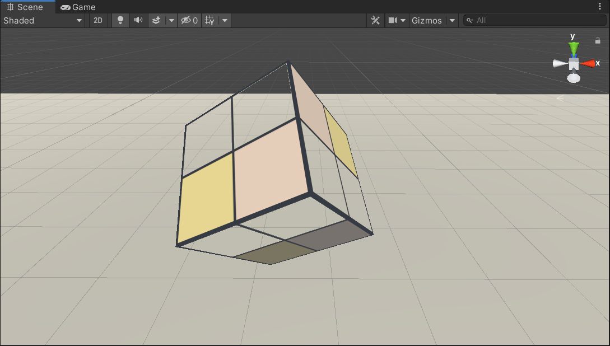
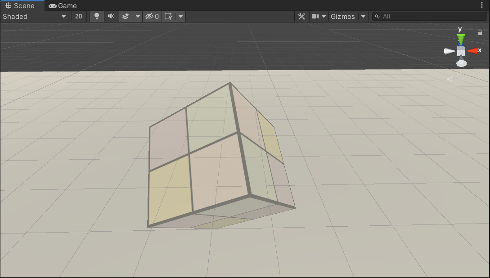
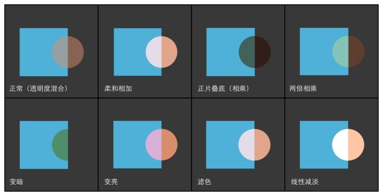
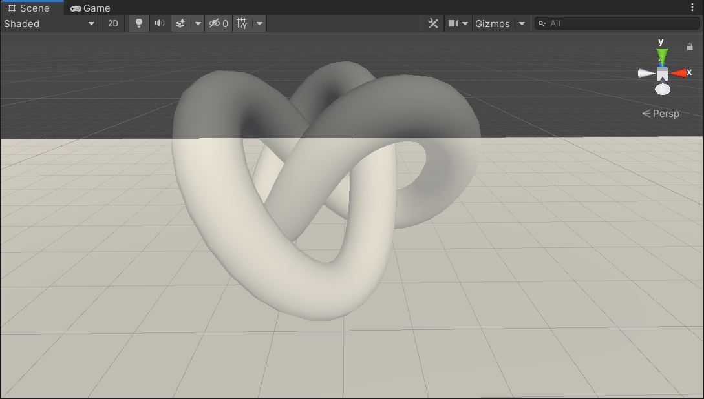
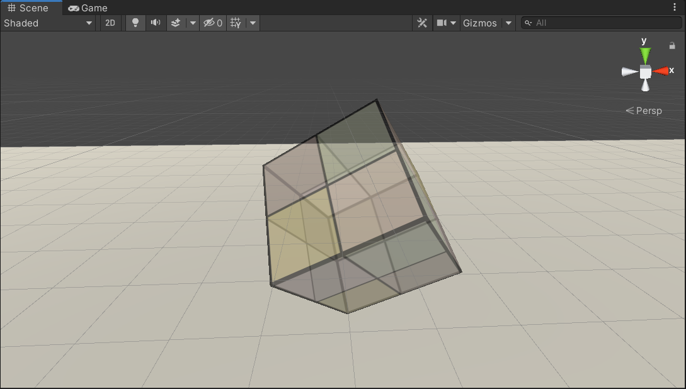

# 透明效果

## 渲染顺序

### 深度测试

渲染一个片元时将他的深度值和存在于深度缓冲中的值进行比较，如果他的值离摄影机更远，那么这个片元不应该被渲染到屏幕上。

### 深度写入

离摄影机更近的片元的覆盖掉较远的片元，并把他的深度值更新到深度缓冲中。

### Unity Shader渲染顺序

| 名称        | 队列 | 描述                                                         |
| ----------- | ---- | ------------------------------------------------------------ |
| Background  | 1000 | 在其他任何队列之前渲染，通常用来渲染背景。                   |
| Geometry    | 2000 | 默认渲染队列，大多数物体使用这个队列，不透明物体使用这个队列。 |
| AlphaTest   | 2450 | 需要透明度测试的队列。                                       |
| Transparent | 3000 | 在之前的队列渲染完后，再按**从后往前**的顺序渲染，使用透明度混合的物体用该队列。 |
| Overlay     | 4000 | 用于实现叠加效果，在最后渲染的物体使用该队列。               |

例：使用透明度测试队列

```glsl
SubShader{
	Tags{"Queue"="AlphaTest"}
	Pass{
		...
	}
}
```

例：实现透明度混合

```glsl
SubShader{
	Tags{"Queue"="AlphaTest"}
	Pass{
		ZWrite Off
		...
	}
}
```

## 透明度测试

只要一个片元的透明度不满足条件（阈值），它就会被舍弃。

```glsl
//任意一个分量小于0，则舍弃该片元
void clip(float4 x){
	if(any(x<0))
		discard;
}
```



## 透明度混合

可以得到真正的半透明效果，他会使用当前片元的透明度作为混合因子，与已经存储在颜色缓冲中的颜色值混合，得到新的颜色。透明度混合需要关闭深度写入，要小心渲染顺序。



### 混合等式和参数

已知源颜色S和目标颜色D，想要得到输出颜色O，就需要使用一个等式来计算，这个等式成为混合等式。当进行混合时我们需要两个等式，一个用于RGB通道，一个用于A通道。当设置混合状态时，我们实际上设置的是混合等式中的**操作**和**因子**。

### ShaderLab 的 Blend 命令

| 命令                                            | 描述                                                       |
| ----------------------------------------------- | ---------------------------------------------------------- |
| Blend Off                                       | 关闭混合                                                   |
| Blend SrcFactor DstFactor                       | 开启混合，并设置混合因子。RGB通道和A通道使用相同的混合因子 |
| Blend SrcFactor DstFactor SrcFactorA DstFactorA | 与上面相同，使用不同的混合因子                             |

$$
O_{rgb}=SrcFactor \times S_{rgb}+DstFactor \times D_{rgb}
\\
O_{a}=SrcFactor \times S_{a}+DstFactor \times D_{a}
$$

### 混合因子

| 参数             | 描述            |
| ---------------- | --------------- |
| One              | 1               |
| Zero             | 0               |
| SrcColor         | 源颜色RGB       |
| SrcAlpha         | 源颜色A         |
| DstColor         | 目标颜色RGB     |
| DstAlpha         | 目标颜色A       |
| OneMinusSrcColor | (1-源颜色RGB)   |
| OneMinusSrcAlpha | (1-源颜色A)     |
| OneMinusDstColor | (1-目标颜色RGB) |
| OneMinusDstAlpha | (1-目标颜色A)   |

### 混合操作

| 操作   | 描述               |
| ------ | ------------------ |
| Add    | 相加，默认混合操作 |
| Sub    | 源颜色减去目标颜色 |
| RevSub | 目标颜色减去源颜色 |
| Min    | 逐分量比较取最小值 |
| Max    | 逐分量比较取最大值 |

### 常见混合类型

```glsl
//正常，即透明度混合
Blend SrcAlpha OneMinusSrcAlpha
    
//柔和相加
Blend OneMinusDstColor One
    
//正片叠底
Blend DstColor One
    
//两倍相乘
Blend DstColor SrcColor
  
//变暗
BlendOp Min
Blend One One
  
//变亮
BlendOp Max
Blend One One
  
//滤色
Blend OneMinusDstColor One
//等同于
Blend One OneMinusSrcColor
  
//线性减淡
Blend One One
```



## 开启深度写入的透明度混合

**第一个Pass开启深度写入，但不输出颜色。第二个Pass进行正常的透明度混合。**

```glsl
Pass{
	ZWrite On
	ColorMask 0		//ColorMask指令用来设置颜色通道的写掩码，ColorMask RGB | A | 0
}
```



## 双面渲染透明效果

默认情况下渲染引擎剔除了物体背面，可以使用Cull指令来控制需要剔除哪个面的渲染图元。

**第一个Pass只渲染背面，第二个Pass只渲染正面**

```glsl
Cull Back | Front | Off
```

