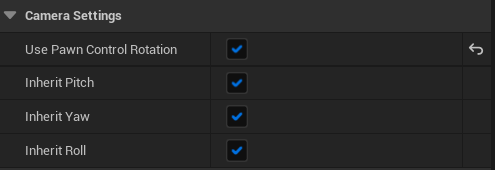
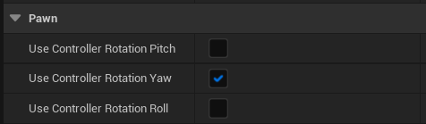
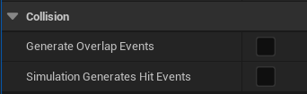
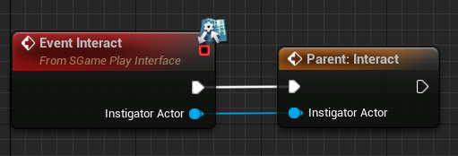

# Unreal Engine Cpp Development

[TOC]

## Class Hierarchy

* Object
* Actor
* Pawn
* Character
* MyCharacter

## Class Prefixes

* U - Classes Deriving from Uobject
* A - deriving from Actor
* F - Structs
* E -Enums
* I - Interfaces

### Examples: 

* Acharacter(Class)

* FHitResult(Struct)

* EDirection(Enum)

## Unreal Property System

### Unreal Macros

UPROPERTY, UFUNCTION, UCLASS, USTRUCT, UENUM 

### Marking up C++

* Editor & Blueprints Access
* Network behavior
* Memory Management

### Handles Boilerplate for us

## PlayerController

### Controller.h

Shared base for AI and players,not visually represented in world.

* Has 'ControlRotation' (for camera use etc.), separate from Pawn's Rotation

  **ControlRotation可以通过SpringArmComp传递给摄影机**

  

  **ControlRotation可以传递给Pawn**

  

  

* PlayerController.h

  One per player, persists for entire session (or until level changes)

  'possess' Pawn and forwards input from player

  Pawn can 'die' and destroyed while PlayerController persists

* AIController.h

  One per AI, holds the 'logic' that controls the Pawn
  
  ## Collision & Physics
  
  * Collision Channels
  * Object Types
  * Reactions: Block, Overlap, Ignore
  
  ### Collision Event
  
  

* Generate Overlap Events：自身是否生成Overlap Events
* Simulation Generates Hit Events：自身是否生成Hit Events。**对没开启Simulate Physics的物体无效**。

## Interface

创建Unreal Interface后，会生成两个Class：

```c++
// This class does not need to be modified.
UINTERFACE(MinimalAPI)
class USGamePlayInterface : public UInterface
{
	GENERATED_BODY()
};

class UECPPACTIONROGUELIKE_API ISGamePlayInterface
{
	GENERATED_BODY()

	// Add interface functions to this class. This is the class that will be inherited to implement this interface.
public:
	UFUNCTION(BlueprintNativeEvent)
	void Interact(APawn* InstigatorActor);
};
```

* **其中ISGamePlayInterface用于继承，USGamePlayInterface用于Implements函数判断是否继承**

* UFUNCTION(BlueprintNativeEvent)：可在C++中实现、也能在蓝图中实现
* UFUNCTION(BlueprintImplementableEvent)：只能在蓝图中实现

### 在蓝图中调用 BlueprintNativeEvent 接口

蓝图类是Cpp类的子类，所以在蓝图中实现的接口会重写Cpp接口。

蓝图类可以调用Cpp类的接口：

## UE_LOG

### 常见用法

```c++
UE_LOG(LogTemp, Warning, TEXT("Hello"));

UE_LOG(LogTemp, Warning, TEXT("The Actor's name is %s"), *YourActor->GetName());

UE_LOG(LogTemp, Warning, TEXT("The boolean value is %s"), ( bYourBool ? TEXT("true") : TEXT("false") ));

UE_LOG(LogTemp, Warning, TEXT("The integer value is: %d"), YourInteger);

UE_LOG(LogTemp, Warning, TEXT("The float value is: %f"), YourFloat);

UE_LOG(LogTemp, Warning, TEXT("The vector value is: %s"), *YourVector.ToString());

UE_LOG(LogTemp, Warning, TEXT("Current values are: vector %s, float %f, and integer %d"), *YourVector.ToString(), YourFloat, YourInteger);
```

**其中字符串的重载运算符 \*，用户将FString转换为期望类型（如TChar\* 字符串数组）**

### UE_LOG 常用函数

```c++
//获取Name而不关心是否是空指针
FString GetNameSafe(AACtor* Actor);

//获取启动游戏后的计时器
float GetWorld()->TimeSeconds; 
```

### DrawDebugString()

用于在世界空间打印字符串进行调试

## Trace

* Trace类型：LineTrace、SweepTrace
* Trace数量：TraceSingle、TraceMulti
* Trace方式：ByChannel、ByObjectType、ByProfile

### ByChannel

**这根射线的 Collision Type 是 WorldStatic**，所有与 WorldStatic 类型为Block的，都会挡住射线

### ByObjectType

设置其他物体的类型

```c++
FCollisionObjectQueryParams ObjectQueryParams;
ObjectQueryParams.AddObjectTypesToQuery(ECC_WorldDynamic);
```

