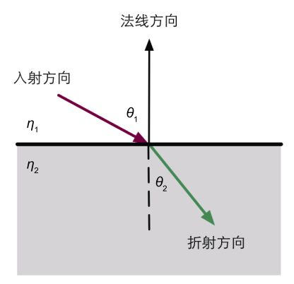
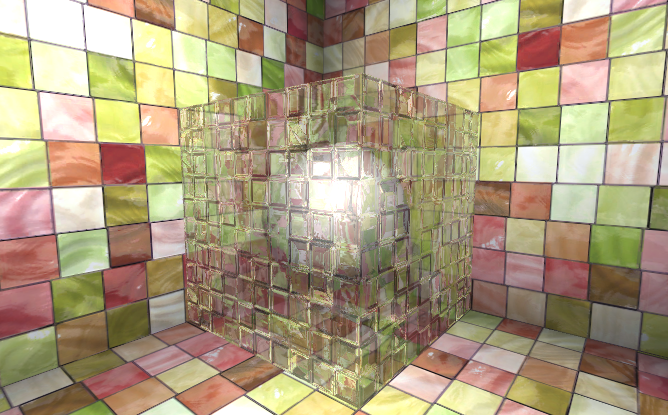

# 高级纹理

## 立方体纹理

立方体纹理是环境映射的一种实现方式。立方体纹理一共包含 6 张图片。对立方体纹理采样需要一个从立方体中心出发的矢量，当它延伸与 6 个纹理之一发生相交，采样的结果由焦点计算而来。

### 天空盒

创建Skybox材质并赋值 6 张纹理即可。在Lighting中设置场景默认Skybox，在摄影机上添加Skybox能覆盖场景Skybox。

### 创建立方体纹理

```glsl
void OnWizardCreate () {
		// create temporary camera for rendering
		GameObject go = new GameObject( "CubemapCamera");
		go.AddComponent<Camera>();
		// place it on the object
		go.transform.position = renderFromPosition.position;
		// render into cubemap		
		go.GetComponent<Camera>().RenderToCubemap(cubemap);
		// destroy temporary camera
		DestroyImmediate( go );
	}
```

指定一个Position和Cubemap资源，即可创建立方体纹理。

### 反射

反射效果使物体看起来像金属。通过入射光线的方向和表面法线的方向来计算反射方向，利用反射方向对立方体纹理采样即可。

```glsl
//在顶点着色器中根据光路可逆远离计算入射方向的反方向
o.worldRefl=reflect(-o.worldViewDir,o.worldNormal);
//在片元着色器采样得到反射颜色
fixed3 reflection=texCUBE(_Cubemap,i.worldRefl).rgb*_ReflectColor.rbg;
```

### 折射

使用**菲涅耳定律**来计算反射角
$$
\eta_{1}\sin{\theta_{1}}=\eta_{2}\sin{\theta_{2}}
$$


```glsl
//在顶点着色器根据光路可逆原理计算入射方向的反方向
//refract() 入射方向、法线、入射光线折射率和折射光线折射率比值
o.worldRefr = refract(-normalize(o.worldViewDir), normalize(o.worldNormal), _RefractRatio);
//在片元着色器采样得到折射颜色
fixed3 refraction = texCUBE(_Cubemap, i.worldRefr).rgb * _RefractColor.rgb;
```

### 菲涅尔反射

菲涅尔反射描述了一种光学现象，当光线照射到物体表面上时，一部分发生反射，一部分进入物体内部，发生折射或散射。常见的例子使在湖边看向水面时近处几乎是透明的，远处只能看到水反射的环境。

Schlick菲涅尔近似等式
$$
F_{Schlick}=F_{0}+(1-F_{0})(1-v \cdot n)^{5}
$$
$F_{0}$是反射系数，用于控制菲涅尔反射的强度，$v$是视角方向，$n$是表面法线。

```glsl
//在顶点着色器中计算反射方向、视角方向
o.worldViewDir = UnityWorldSpaceViewDir(o.worldPos);
o.worldRefl = reflect(-o.worldViewDir, o.worldNormal);
//在片元着色器中计算菲涅尔反射，并使用结果值混合漫反射光照和反射光照
fixed3 reflection = texCUBE(_Cubemap, i.worldRefl).rgb;
fixed fresnel=_FresnelScale+(1-_FresnelScale)*pow(1-dot(worldViewDir,worldNormal),5);
fixed3 diffuse=_LightColor0.rgb*_Color.rgb*max(0,dot(worldLightDir,worldNormal));
fixed3 color=ambient+lerp(diffuse,reflection,saturate(fresnel)*atten);
```

一些实现也会直接把 fresnel 和反射光照相乘后叠加到漫反射光照上，模拟边缘光照的效果。

## 渲染纹理

把三维场景渲染到一个中间缓冲，即**渲染目标纹理（Render Texture）**，而不是传统的帧缓冲。与之相关的是**多重渲染目标（MRT）**，允许我们把场景同时渲染到多个渲染目标纹理中，而不需要为每个渲染目标纹理单独渲染完整场景。延迟渲染就是多重渲染目标的一个应用。

在Unity中有两种方式使用渲染纹理。一种方式是在Project目录下创建一个渲染纹理，然后把某个摄影机的渲染目标设置成该渲染纹理。另一种方式是在屏幕后处理时使用GrabPass命令或OnRenderImage函数来获取当前屏幕图像。

### 镜子效果

使用一个渲染纹理作为输入属性，并把该渲染纹理在水平方向上翻转后直接显示在物体上即可。

```glsl
//在顶点着色器中水平翻转纹理坐标
o.uv=v.texcoord;
o.uv.x=1-o.uv.x;
```

### 玻璃效果

在 Unity 中可以使用 GrabPass 来获取屏幕图像。当在 Shader 中定义一个 GrabPass 后，Unity会把当前屏幕的图像绘制在一张纹理中，以便在后续 Pass 中访问它。使用GrabPass时需要额外小心**渲染队列**设置。尽管代码不包含混合指令，但我们往往需要把所有不透明物体都渲染到屏幕上之后再能获取正确的屏幕图像（即"Queue"="Transparent"）。

**玻璃效果包括反射和折射两部分。将使用Cubemap实现反射效果，使用GrabPass实现折射效果。**

```glsl
//使用GrabPas来获取屏幕图像，抓取的图形存入该纹理中
GrabPass{"_RefractionTex"}

//在顶点着色器中调用获取屏幕图像采样坐标
o.scrPos = ComputeGrabScreenPos(o.pos);

//使用_Distortion属性使折射采样坐标偏移
float2 offset = bump.xy * _Distortion * _RefractionTex_TexelSize.xy;
i.scrPos.xy = offset * i.scrPos.z + i.scrPos.xy;
```



## 程序纹理

**程序纹理（Procedural Texture）**指的是由计算机生成的图像，使用一些特定的算法来创建个性化图案或非常真实的自然元素。使用程序纹理的好处在于我们可以使用各种参数来控制纹理的外观。