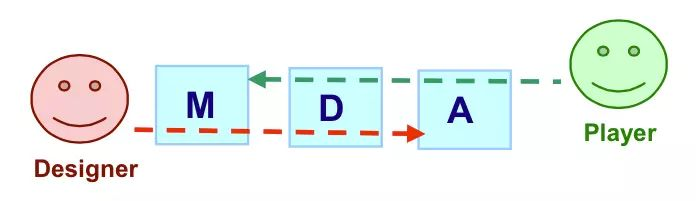
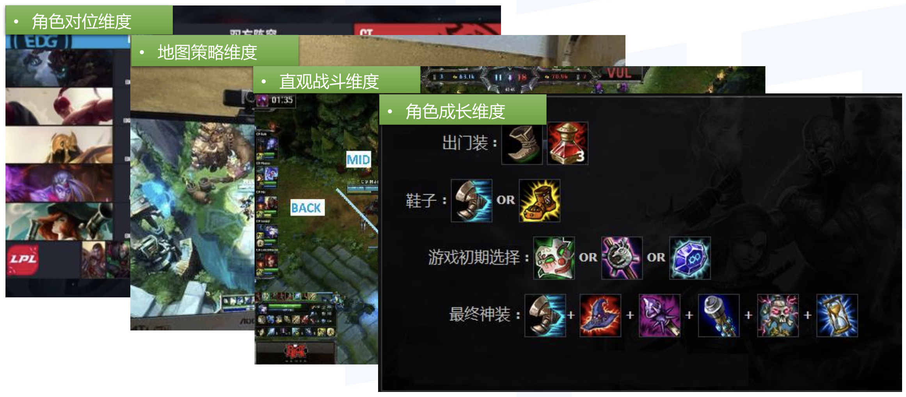

# MDA

## 什么是MDA

MDA是一种游戏的分析研究框架，它将游戏拆解为不同的组件以正式化游戏消费。具体来说，玩家会在游戏中感觉到**乐趣**，这个乐趣由游戏这一**系统**提供，而更深层次的是在背后支撑游戏系统运转的**规则**。这三者用更抽象的组件描述就是**机制（Mechanics）**、**动态（Dynamics）**、**美学（Aesthetics）**。

## M：机制（Mechanics）

游戏的基本规则，比如按下鼠标就可以设计，比如按下空格可以从一个平台跳向另一个平台。机制是在算法层面和数据层面表示的游戏逻辑，比如那些伤害公式。

**机制入手构筑玩法**

| 优点                                               | 缺点                                                         |
| -------------------------------------------------- | ------------------------------------------------------------ |
| 在策略游戏和独立游戏中依然是占据主导地位的设计方法 | 大量的规则交叉堆叠相互耦合，从具体机制入手着眼“局部”，难以把控全局 |
| 规则如同每一行代码，能快速建造游戏                 | 有很多经典的设计可以借鉴，一不小心就会出现重复造轮子的情况   |

## D：动态（Dynamics）

家行为和游戏之间的交互。在这个模型中，最重要的部分是D，设计师和玩家通过这个部分进行间接的交互。玩家通过这个动态的部分，感受到设计师希望通过机制带来的体验，而设计师则通过动态部分得到玩家体验的反馈从而调整游戏机制。这种交互不仅仅是玩家的操作，也包括了视听语言，包括玩家从游戏环境，游戏美术和游戏音乐中获得的体验，甚至包括了不同玩家之间的合作和对抗。

**动态维度：**

**动态元素:**

观察->确认->决策->行动

1. 观察：观察到什么信息？
2. 确认：因为观察到的信息意识到什么情景？
3. 决策：基于这个情景做出什么样的决定？
4. 行动：用什么方式执行这个决策？

**动态入手构筑玩法**

| 优点                                                     | 缺点                                                         |
| -------------------------------------------------------- | ------------------------------------------------------------ |
| 动态元素直接面向用户体验，能够更好的关注到目标用户的需求 | 如果缺乏对机制的理解，对动态元素进行调整时容易导致矛盾的体验 |
| 利用动态元素能够更快的进行改良和优化大型游戏             |                                                              |

## A：美学（Aesthetics）

玩家获得的游戏体验。它包括了：

1. 感觉（Sensation）：游戏作为让人感到愉快的存在
2. 幻想（Fantasy）：作为让想象成真的存在
3. 叙事（Narrative）：游戏作为戏剧的存在
4. 挑战（Challenge）：游戏作为跨越障碍的过程
5. 友谊（Fellowship）：游戏作为社会框架
6. 发现（Discovery）：游戏作为未知领域
7. 表达（Expression）：游戏作为自我发现的作用
8. 休闲（Submission，或译为子任务）：游戏作为消遣的活动

**审美入手构筑玩法**

| 优点                                   | 缺点                               |
| -------------------------------------- | ---------------------------------- |
| 直接的关注思想表达和情感传递           | 过度关注审美有时候会导致游戏性崩塌 |
| 更容易吸引眼球，能够留下深刻的第一印象 | 容易导致资源浪费                   |

