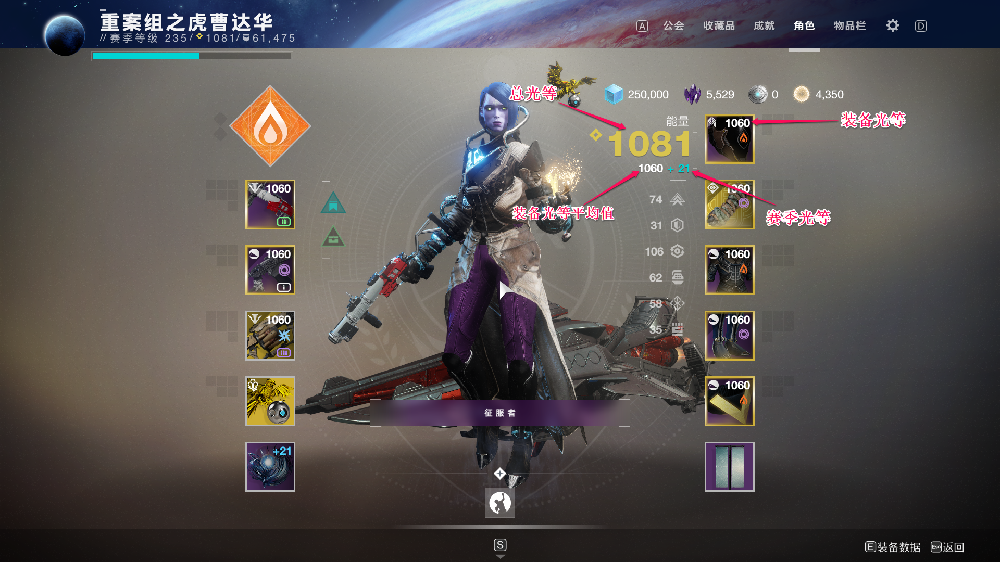
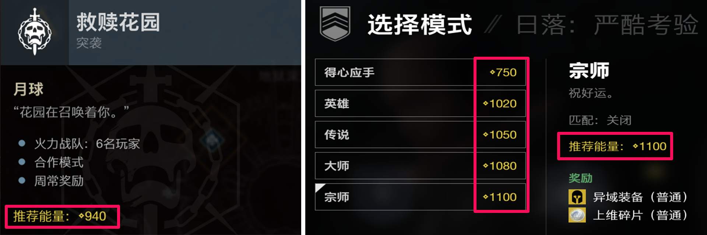

# 《命运2》光等灌注系统的过去和未来

*作者-翟贵彧*

## 1.关于这款游戏

​	《命运2》是以抵抗太阳系中外星种族入侵为背景的MMO-RPG-FPS游戏。可以收集独特的装备来个性化你的外观和游戏风格。进行PvE合作任务，或与其他玩家在PvP模式中进行竞争。《命运2》采用赛季更新机制，每个赛季都会增加新装备和新活动。

## 2.光等灌注系统机制

### 2.1名词解释

**装备光等**：装备的属性之一，作为因子参与计算角色光等，对装备本身无任何加成。

**赛季光等**：随着赛季经验值的增加而增加，在赛季结束时重置为0。

**角色光等**：角色的基础属性，**角色光等 = 八件装备光等的平均值 + 赛季光等**。

**灌注**： 提升装备光等的方式，**消耗光等更高的物品来提升一件物品的光等**。

### 2.2光等的作用

​	魔兽世界等MMORPG游戏里等级的作用更多的是体现在不停膨胀的各项数值上面，**《命运2》里的光等仅仅会影响玩家是否可以和怪物公平的作战**，所以光等比起《魔兽世界》的装备等级更像是一种限制而不是提升。

​	《命运2》中每个模式都有推荐光等。若低于推荐光等，角色受到的伤害会增加，造成的伤害会减少；而高于推荐光等时，并不会在战斗中有任何优势，仅能公平地与怪物作战。

​	**光等优势在部分PvP模式中也有作用**。

### 2.3光等和赛季的联系

1. **赛季开始时会将装备光等上限提高80点，同时部分游戏模式也等比例地提高推荐光等**。这就要求玩家每个赛季都要刷更高光等的装备才能正常参与所有游戏模式。
2. **每周能获得的更高光等的武器数量有限**。每个赛季将持续三个月，大部分玩家需要两个月时间才能达到赛季光等上限。这一设计避免了玩家短期高强度爆肝，而转换成长期健康游戏。
3. 年度更新（四个赛季）之后提升初始光等。每次年度更新后新注册玩家的光等与老玩家光等相同，避免新玩家要先攀升高达一千点光等才能正常游戏。

## 3.光等系统的过去

​	在《命运1》的时代还没有灌注系。《命运1》进入第二年后，所有的旧武器的光等全部都停留在了160点，没有任何提升空间。如同《魔兽世界》的玩家每进入一个新版本都要换上全新的装备，彼时的《命运1》也是如此。但正如前文提到的光等机制与《魔兽世界》的等级数值膨胀有本质区别，上版本的武器仅仅因为官方的限制就不能继续使用。很多玩家对此不满，在玩家的疯狂反馈之后，Bungie官方**推出了灌注功能，装备可以无限制地提升到当前赛季最高光等**。

​	灌注功能本身也先后经历了多次调整：

1. 灌注光等会打折
2. 可灌注的装备种类严格限制
3. 灌注材料非常稀有

到《命运2》的时代，灌注已经近乎免费，仅仅消耗任意一件高光等的装备就可以提升自己称手装备的光等。

## 4.存在的问题

​	《命运》系列2014年登陆主机平台，作为一款运营了7年的游戏，它和那些长期运营的游戏面临同样的问题——**如何提供新的游戏内容**。

​	能否推出玩家喜欢的新内容，很大程度上影响一款游戏的生命周期。在《命运1》和《命运2》的前两年，Bungie都能持续带给玩家惊喜，推出全新技能树、开放耐玩的副本、投放与众不同的新武器。但当《命运2》进入第三年后，**由于灌注功能的存在，强势的武器就这么几件**。几乎95%的武器都被当做没有用处的玩具枪，也就意味着Bungie辛辛苦苦设计的武器有95%没有机会登场，整个游戏环境趋于同质化。

​	如前文提到的《命运2》光等机制与数值膨胀有根本的冲突，并且还要考虑新武器在PvP模式中的平衡性。所以棒机并没有让每个赛季加入的新武器全面超越旧武器，那么已经占据着各个类别顶端的旧武器，就几乎无法被撼动。于是玩家带着最强的一套装备来到新副本，拿到全新但非常鸡肋的武器，骂了一句垃圾Bungie，然后随手把新武器分解。**如果一套装备可以适应过去、现在甚至未来所有的副本，显然不是一款游戏可持续发展的道路。**

​	并不是Bungie不会创新，而是因为**玩家对游戏公司创新方面的需求几乎是无限的，玩家消化新内容的速度远远超过游戏公司的开发速度**。玩家希望每一把武器都有用武之地；每一次副本都印象深刻；每一场PvP都公平激烈，但是没有游戏公司能做到这一点。

## 5.光等系统的未来

​	对于长期运营的游戏而言，**推陈出新只有三种方式：**

1. 不断进行数值膨胀，旧装备自然淘汰。例如《魔兽世界》《暗黑破坏神3》。
2. 推出平衡性补丁，打压成熟的玩法套路，逼迫玩家探索新的套路。例如《英雄联盟》《星际争霸2》《CS:GO》。
3. 退环境机制，物品有一定的使用期限，过期后无法使用。例如《炉石传说》。

​	因为《命运2》有PvP模式，所以天生不适合第一种数值膨胀方式。第二种方式被当作“教玩家玩游戏”而饱受玩家诟病，常出现在对平衡性有高要求的电竞游戏。《命运2》依赖的是大量PvE内容和娱乐向的PvP模式，没有必要趟“教玩家玩游戏”这潭浑水。

​	于是只剩下**退环境**这种选择。也许同炉石传说推出退环境机制一样会被玩家激烈反对，但是为了延长游戏寿命，必须忍受短期的疼痛。与其用突如其来的平衡性补丁宣判一把武器的死亡，是倒不如预先设定保质期，让玩家坦然接受。对于硬核玩家，**如果玩家每个赛季都有新装备值得去刷，那当然比用一成不变的装备重复操作更有动力**。对于休闲玩家，也没必要为了一把退环境的武器去参与老旧的游戏模式。

​	回顾《命运1》的光等系统，本身起到推进玩家参与活动、淘汰老旧装备两大功能，后者随着灌注功能的加入而失效，现在才需要退环境机制来平衡游戏环境。每一款长期运营的游戏到后期都会遇到冲突问题，解决冲突问题的方式往往是一种妥协，权衡各方利弊后得到的最优解。

​	期待《命运2》迎来第四个年头。