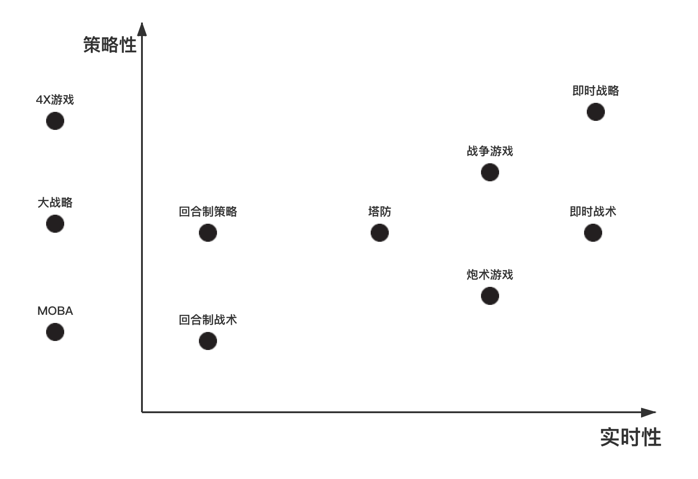

# 策略游戏品类

## 概述

> 要求游戏的参与者“拥有”做出决策的能力。在战略游戏中，决策对游戏的结果产生至关重要的影响。战略通常是与运气相对，然而，很多游戏既包含战略成分又包含运气成分，这给战略游戏的划分带来一定的困难。因此，我们可以用游戏的战略成分来描述这个游戏。

### 特点

1. 强调技巧思维和计划
2. 计划针对对手的一系列行动
3. 机会因素扮演的角色较小。玩家之间存在概率博弈，但游戏机制本身随机性低。
4. 探索、管理、战斗

### 子分类

#### 策略性 vs 实时性

### 名词解释
#### 战略 vs 战术

|        | 战术                           | 战略                           |
| ------ | ------------------------------ | ------------------------------ |
| 定义   | 为达到特定目的而精心策划的行动 | 一个组织的蓝图，包括期望和终点 |
| 专注于 | 行动                           | 计划                           |
| 层级   | 中层                           | 高层                           |
| 方式   | 反应性                         | 前瞻性                         |
| 灵活度 | 高                             | 低                             |
| 方向   | 当前情况                       | 面向未来                       |

#### 回合制 vs 即时

**回合制：**回合制战斗情景的APM要求低很多，不需要长时间维持高APM。APM虽然也是越高越好，但对对手没有影响。

原因是：玩家在回合制战斗中不需要连续控制角色移动和切换目标，并且由于回合制有出招安全时间，所以高APM主要用于缩短对手出招间隔时间来增大对手压力，而不会对对手角色造成实质的伤害。

**即时：**即时制战斗情景中要求玩家有较高的有效APM（每分钟按键操作数），并且是越高越好、维持时间越长越好。

原因是：即时制游戏中角色行动以自我为中心。对抗双方势均力敌的情况下，操控速度快的一方会具有优势。维持较高的APM可以扩大优势。即时制RPG战斗中，快速操作可以提高出招频率、更敏捷地移动，在DPS和角色控制上全面压制对手。

**PS：**需要注意的是，即时制的高操作速度要求不是必须的，即时制游戏的节奏并不一定比回合制快。

## 回合制战术（SRPG）

玩家控制作战部队，借助真实或可信的军事战术动，完成指定任务。

e.g.[《光之子》](https://www.bilibili.com/video/BV1oJ411w7fA?p=7	)

## 回合制战略（狭义SLG）

所有的玩家轮流自己的回合，只有自己的回合，才能够进行操纵。

**狭义SLG：**特指回合制策略游戏以及即时SLG，有别于SIM类“生活”模拟游戏（《模拟人生》）。

**广义SLG：**模拟经营、飞行模拟、驾驶模拟、战棋、回合制RPG、回合制策略、即时策略。

**4EX概念：**探索、扩张、开发、消灭。目前几乎所有战略游戏都有4X体系的内容。

e.g.[《文明6》](https://www.bilibili.com/video/BV1Cs411c7a2?from=search&seid=6324456614001227037)

## 塔防

在地图上建造炮塔或类似建筑物，以阻止游戏中敌人抵达堡垒的。一般而言，敌人并不会主动攻击炮塔。当敌人被消灭时，玩家可获得奖金或积分，用于购买炮塔或升级炮塔。敌人以一波波进攻，大部分塔防会在一波后暂停以让玩家以积分升级或增加炮塔。

e.g.[《植物大战僵尸》](https://www.bilibili.com/video/BV12b41167b7?from=search&seid=16238394289052775224)

## 炮术游戏

玩家进行射击，考虑弹道计算、地形、弹药和风向等问题。

e.g.[《愤怒的小鸟》](https://www.bilibili.com/video/BV1di4y1G72x?from=search&seid=9190678317937390977)

## 战争游戏

强调战场上的战术和战斗，还原历史真实性或接近历史真实性。带有策略模式，玩家可以规划作战方案，或者选定战场。对比花在实际战斗上的时间**，玩家花在策略玩法上的时间相对少⼀些。**

e.g.[《武装突袭3》](https://www.bilibili.com/video/BV1dx411G7x3?from=search&seid=6674406033122374612)

## 即时战术

## 即时战略

