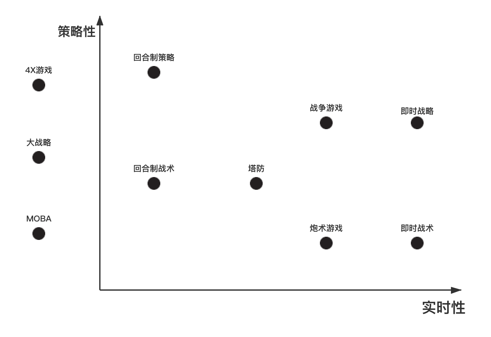
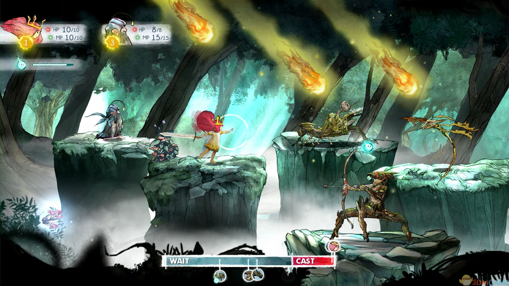
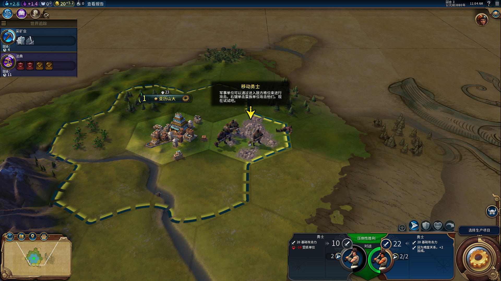
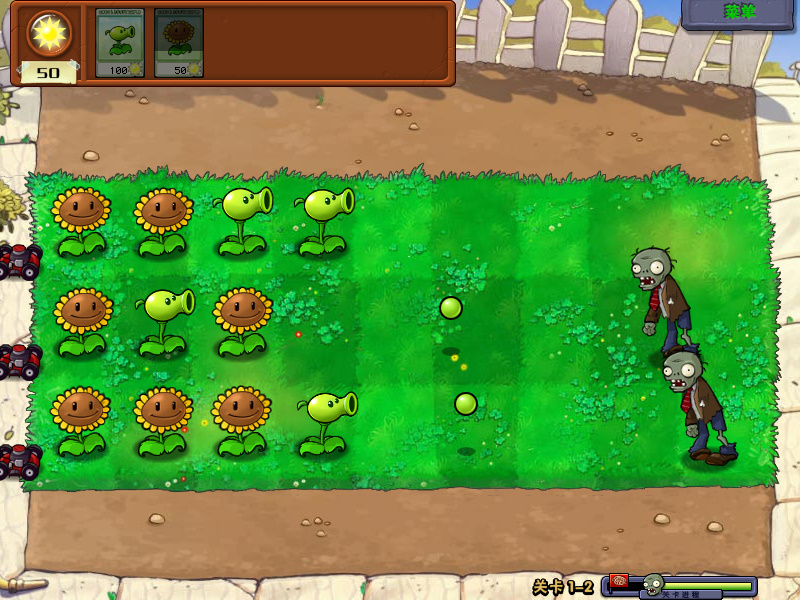
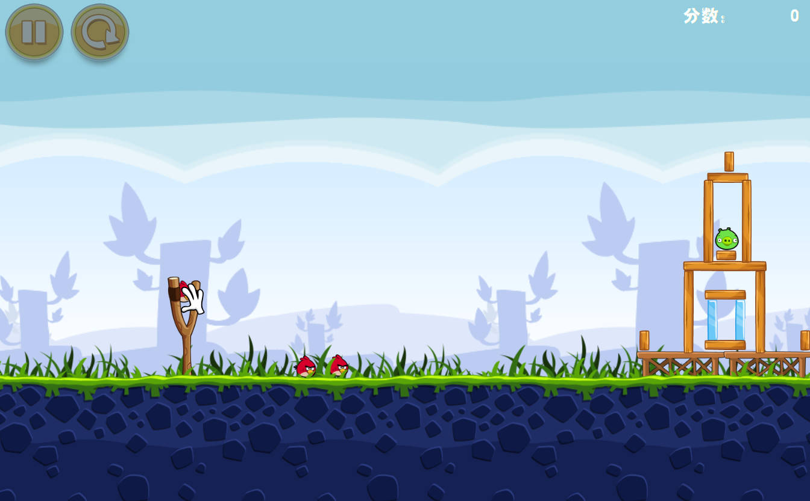
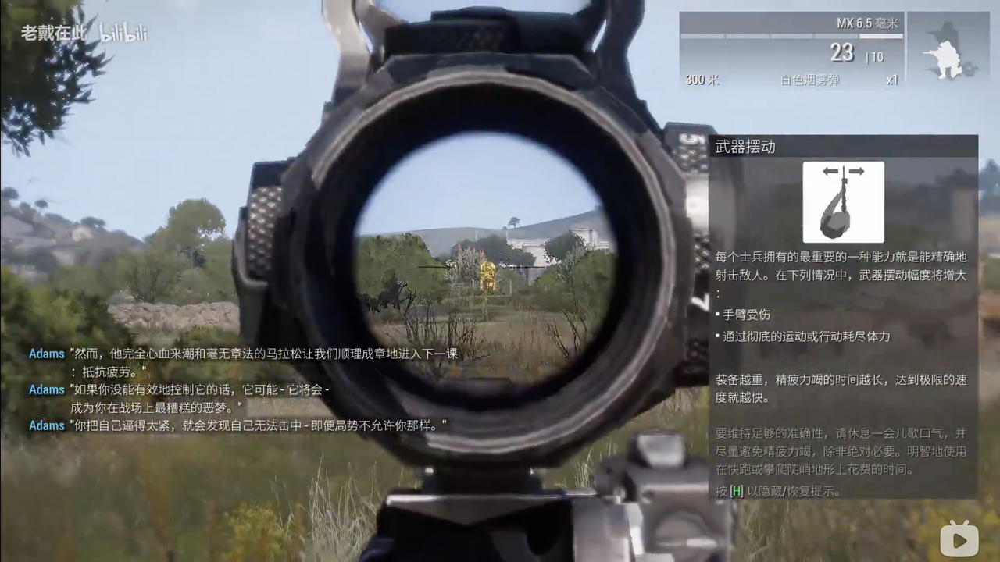
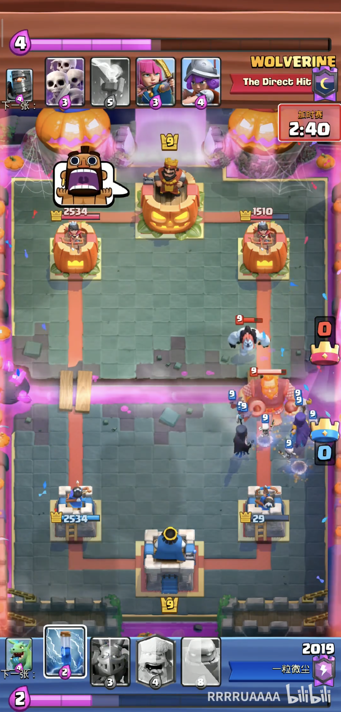
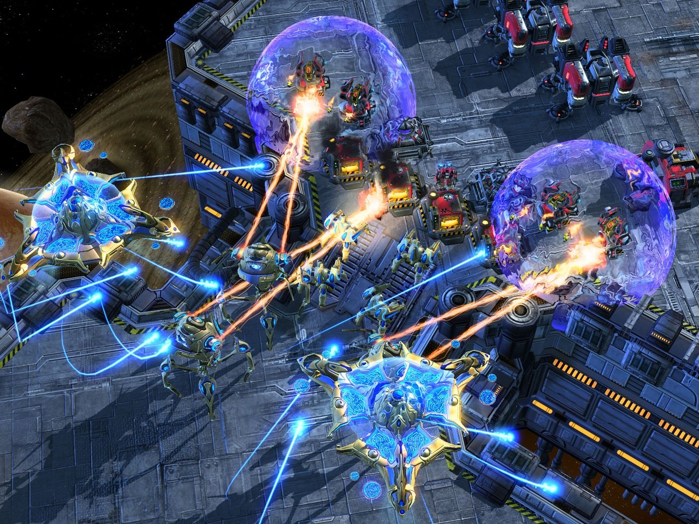

# 策略游戏品类

## 概述

> 要求游戏的参与者“拥有”做出决策的能力。在战略游戏中，决策对游戏的结果产生至关重要的影响。战略通常是与运气相对，然而，很多游戏既包含战略成分又包含运气成分，这给战略游戏的划分带来一定的困难。因此，我们可以用游戏的战略成分来描述这个游戏。

### 特点

1. 强调技巧思维和计划
2. 计划针对对手的一系列行动
3. 机会因素扮演的角色较小。玩家之间存在概率博弈，但游戏机制本身随机性低。
4. 探索、管理、战斗

### 子分类

#### 策略性 vs 实时性

### 名词解释
#### 战略 vs 战术

|        | 战术                           | 战略                           |
| ------ | ------------------------------ | ------------------------------ |
| 定义   | 为达到特定目的而精心策划的行动 | 一个组织的蓝图，包括期望和终点 |
| 专注于 | 行动                           | 计划                           |
| 层级   | 中层                           | 高层                           |
| 方式   | 反应性                         | 前瞻性                         |
| 灵活度 | 高                             | 低                             |
| 方向   | 当前情况                       | 面向未来                       |

总的来说战略指的是范围相当广的武器的运用，以及外交、情报、经济资源的使用；而战术则只关注近期的一场战役的胜负。而到了电子游戏领域，这个差别通常只体现在**有没有建筑和单位的生产上面。**

#### 回合制 vs 即时

**回合制：**回合制战斗情景的APM要求低很多，不需要长时间维持高APM。APM虽然也是越高越好，但对对手没有影响。

原因是：玩家在回合制战斗中不需要连续控制角色移动和切换目标，并且由于回合制有出招安全时间，所以高APM主要用于缩短对手出招间隔时间来增大对手压力，而不会对对手角色造成实质的伤害。

**即时：**即时制战斗情景中要求玩家有较高的有效APM，并且是越高越好、维持时间越长越好。

原因是：即时制游戏中角色行动以自我为中心。对抗双方势均力敌的情况下，操控速度快的一方会具有优势。维持较高的APM可以扩大优势。即时制RPG战斗中，快速操作可以提高出招频率、更敏捷地移动，在DPS和角色控制上全面压制对手。

**PS：**需要注意的是，即时制的高操作速度要求不是必须的，即时制游戏的节奏并不一定比回合制快。

## 回合制战术（SRPG）

玩家控制作战部队，借助真实或可信的军事战术动，完成指定任务。

e.g.[《光之子》](https://www.bilibili.com/video/BV1oJ411w7fA?p=7	)（育碧）

**即时回合制（ATB回合制）**

战斗的循环依次为以下的顺序：行动冷却、下达指令、等待吟唱、技能释放。待技能释放之后又会再次进入行动冷却。源于《最终幻想》系列。

## 回合制战略（狭义SLG）

所有的玩家轮流自己的回合，只有自己的回合，才能够进行操纵。

**狭义SLG：**特指回合制策略游戏以及即时SLG，有别于SIM类“生活”模拟游戏（《模拟人生》）。

**广义SLG：**模拟经营、飞行模拟、驾驶模拟、战棋、回合制RPG、回合制策略、即时策略。

**4EX概念：**探索、扩张、开发、消灭。目前几乎所有战略游戏都有4X体系的内容。

e.g.[《文明6》](https://www.bilibili.com/video/BV1Cs411c7a2?from=search&seid=6324456614001227037)（2K）

## 塔防（TD）

**核心玩法：**在地图上建造炮塔或类似建筑物，以阻止游戏中敌人抵达堡垒的。一般而言，敌人并不会主动攻击炮塔。当敌人被消灭时，玩家可获得奖金或积分，用于购买炮塔或升级炮塔。敌人以一波波进攻，大部分塔防会在一波后暂停以让玩家以积分升级或增加炮塔。

塔防游戏的核心逻辑是合理利用**有限**资源建立防御以应对敌人进攻。没有资源限制的塔防游戏是行不通的。

e.g.[《植物大战僵尸》](https://www.bilibili.com/video/BV12b41167b7?from=search&seid=16238394289052775224)（PopCap）

## 炮术游戏

**核心玩法：**玩家进行射击，考虑弹道计算、地形、弹药和风向等问题。

一般来说炮术游戏等价于坦克游戏（或海战游戏）。2009 《愤怒的小鸟》利用手机触控交互的特性，使得玩家可以直观地控制炮弹发射角度，成为当时最热门的游戏。

e.g.[《愤怒的小鸟》](https://www.bilibili.com/video/BV1di4y1G72x?from=search&seid=9190678317937390977)（Rivio）

## 战争游戏

强调战场上的战术和战斗，还原历史真实性或接近历史真实性。带有策略模式，玩家可以规划作战方案，或者选定战场。对比花在实际战斗上的时间**，玩家花在策略玩法上的时间相对少⼀些。**

e.g.[《武装突袭3》](https://www.bilibili.com/video/BV1dx411G7x3?from=search&seid=6674406033122374612)（Bohemia）

《武装突袭》系列由波希米亚互动工作室开发的FPS游戏，该公司的主要业务是为各国军方开发军事训练模拟程序。后来这套军事模拟系统降低难度后成为《武装突袭》系列游戏。

《武装突袭》系列游戏仍然具有极高的军事仿真性。例如《武装突袭3》的第一个任务是掩护小队撤退。普通FPS玩家会跟随小队消灭沿途敌人。高玩会利用战场信息定位敌方迫击炮基地，仅用一颗子弹狙杀迫击炮手即可成功掩护小队撤退。

## 即时战术（RTT）

它属于战术战争游戏，玩家以实时的方式在模拟的战场环境中进行战术指挥。它和即时战略不同的就是**没有了经典的资源采集和建筑建造过程**，更强调各种兵种的重要性，并专注于战术上的使用。

e.g.[《皇室战争》](https://www.bilibili.com/video/BV1dJ41177nz?from=search&seid=16799667107622306441)(SuperCell)

## 即时战略（RTS）

标准的即时战略游戏会有资源采集、基地建造、科技发展等元素。在玩家指挥方面，即时战略游戏通常可以独立控制各个单位，而不限于群组式的控制。

**和RTT的区别：**一个常见的误解是认为：“只要是即时的战争游戏就算是即时战略游戏”，其实即时战略游戏在真正意义上的认定是比较严格的。**即时战略游戏在战略的谋定过程上必须是即时的。**所以当一款战争游戏只有战斗时是采即时制，而在采集、建造、发展等战略元素是采回合制，那就不能算是即时战略。

e.g.[《星际争霸2》](https://www.bilibili.com/video/BV1Ws411x7AB)(Blizzard)

## 尾巴

